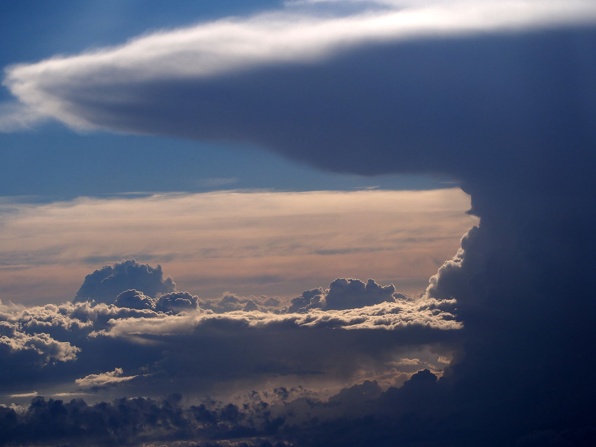

[comment]: # (A22V)
[comment]: # (Les cumulonimbus sont dangereux car :)

#  ‼️ Explication en cours de rédaction 

<figcaption> <a href="https://commons.wikimedia.org/wiki/File:Cumulonimbus_from_an_airplane_at_32000ft,_pic3.JPG" title="via Wikimedia Commons">Alf van Beem</a> / CC0</figcaption>

Les cumulonimbus (ou CB) sont **dangereux** car... ils se passent pleins de trucs dangereux dedans :  
fortes averses, foudre, tornades, très fortes ascendances, rafales descendantes et grêle.  
Les cumulonimbus sont les nuages qui donnent les **orages**.

Un cumulonimbus peut culminer à plus de 20km de haut, avec des vents ascendants de plus de 150km/h.

*Même si ça a l'air loin, en vol ça reste quand même dangereux plusieurs kilomètres aux alentours.*

Photo par [Bidgee](CB.jpg) / [CC BY-SA] (https://creativecommons.org/licenses/by-sa/2.5)

Mais, vu du sol, ça peut être magnifique :  

<iframe width="560" height="315" src="https://www.youtube.com/embed/818vzaydelY" frameborder="0" allow="accelerometer; autoplay; encrypted-media; gyroscope; picture-in-picture" allowfullscreen></iframe>