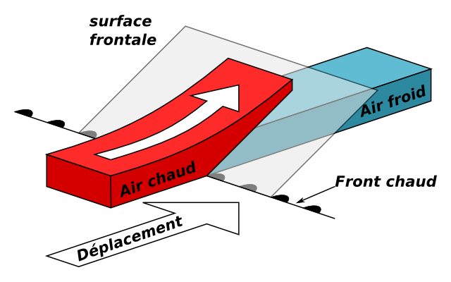
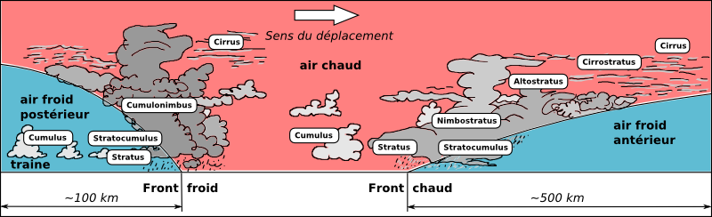

<!--
A42V
Pour un même volume d'air, l'air chaud :
tend à descendre par rapport à l'air froid-6

se mélange volontiers à l'air froid-6

est plus léger que l'air froid
-->

# Résumé

### L'air chaud monte car il est plus léger
L'**air chaud** est **plus léger que l'air froid**.  Il va donc monter par dessus.  
Comme la fumée d'un feu de feuilles mortes.

L'air froid va rester en dessous.  
Comme l'eau au fond de la mer qui est plus froide qu'en surface.  

Ce qui intéresse le parapentiste, c'est quand une bulle d'air chaud, plus légère, monte, pour monter avec.  
On appelle ça un thermique.  

### Pas de mélange
L'air est un bon isolant.  
Ce qui implique que deux masses d'air avec des températures différentes, **ne** vont **pas** se mélanger.

# 🦾 Version détaillée 📚📝

Tout d'abord il faut rappeler que l'**air est un gaz** (un ensemble de plusieurs gaz, mais ne compliquons rien pour l'instant).  
Et…

## Tout gaz a une masse

*1 litre d'air* a une masse d'environ *1,23 gramme* (pour un air sec, à 15℃, au niveau de la mer).  
Ça ne vous parait pas beaucoup ?  

### *“ 1 m&sup3; d'air = 1,23kg*

C'est la même chose que de dire qu'un cube d'1m de côté “rempli d'air” a une masse de 1,23kg.  
Le premier qui persiste à penser que l'air n'a pas de poids est invité à mon prochain déménagement 😉

## Attention chaud devaa*aant* *!*

Prenons notre même cube d'air, et posons-le —délicatement— dans un champ. Mais pas n'importe quel champ s'il vous plaît.   

Un joli champ, assez sec, et à l'abri du vent.  
Pourquoi ? À l'abri du vent pour ne pas courir après notre cube d'air. Assez sec pour qu'il puisse chauffer facilement.  
Et joli ? Ça ne change rien, mais c'est toujours plus agréable ! Voilà. D'autres questions ?

Donc. En bullant tranquilou au soleil, notre cube d'air va chauffer.  
Si on chauffe un gaz, il se dilate. C'est à dire que toutes ses molécules seront plus éloignées les unes des autres. 
Donc, à moins de compresser le gaz, toutes les molécules de l'air qu'on avait au début dans notre cube ne vont plus tenir à l'intérieur. Il va falloir “en enlever” pour garder le même volume de gaz.  

C'est pour ça que notre même cube d'air, chauffé à 25℃, n'a désormais comme masse *plus que* 1,18kg.

## Densité de l'air chaud

Notre cube d'air chaud est moins dense que notre cube d'air froid. Autrement dit :  
✅ L'air chaud est plus léger que l'air froid.

Prenons plein de bulles d'air chaudes et froides. Les plus froides, plus lourdes, vont avoir tendance à chuter au fond, et les plus chaudes vont avoir tendance à monter.

❌ <strike>l'air chaud tend à descendre par rapport à l'air froid</strike>  
➡️ faux, c'est l'inverse

## Vive la mixité ?

Vrai pour plein d'autres sujets, les masses d'air ne sont pas trop d'accord avec cet adage.

✅ En météo, **deux masses d'air <u>ne se mélangent pas</u>** (si l'on considère une échelle de temps "météorologique").

Et les raisons sont plutôt complexes (mauvaise conduction d'énergie, vitesse de déplacement, densité, etc). Voir par exemple [ici](https://physics.stackexchange.com/questions/7317/why-dont-different-air-masses-mix-immediately).  
Soyons honnête, je ne sais pas entièrement expliquer pourquoi. Si tu es un expert sur le sujet, s'il te plaît **[écris-moi](mailto:gcerquant@gmail.com?Subject=Why Air masses do Not mix)** 🙏, j'ai plein de questions.

## 🤨 *Pourquoi ça m'intéresse ?*
Les masses d'air ne se mélangent pas. Soit.  

Ce qui est intéressant, c'est les conséquences de cette absence de mélange. 

La zone de séparation entre deux masses d'air s'appelle un front.  
Son vocabulaire militaire laisse imaginer que c'est là que des phénomènes météos intenses ont lieu.  

Par exemple :

### Fronts 
* quand une masse d'air chaude se déplace à l'endroit d'une masse d'air plus froide, en raison de sa densité plus faible, la masse d'air chaude va “grimper” au-dessus de la masse d'air froide. En s'élevant en altitude, l'air chaud va se refroidir, jusqu'à condenser. Et donc, des nuages apparaître.  
 [via [Pba](http://www.pba.asso.fr/index.php?option=com_content&view=article&id=6:instruction&catid=2:club&Itemid=12)]
* Le même phénomène existe avec une masse d'air froide. On parle de **front froid**. Le phénomène sera plus rapide et plus violent. Il apporte des averses. 

 [via [Pba](http://www.pba.asso.fr/index.php?option=com_content&view=article&id=6:instruction&catid=2:club&Itemid=12)]

### Inversion
* un autre phénomène, peu apprécié des parapentistes : une masse d'air chaud en altitude.  
On appelle ça une **couche d'inversion**. Comme visible sur cette photo, cela bloque l'ascension des thermiques.

