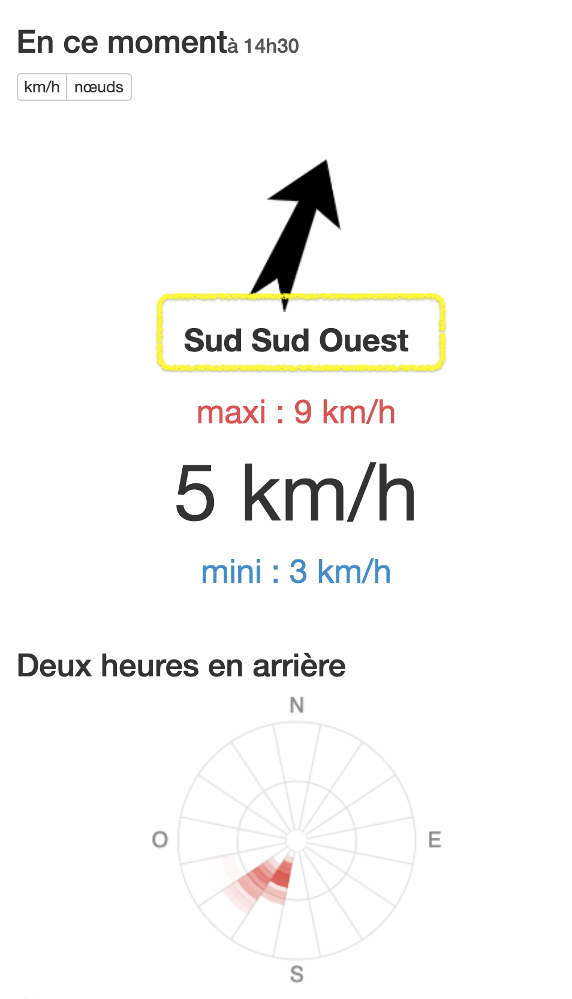

<!--
A58V
La direction du vent donnée par les services météo est toujours :
la direction d'où vient le vent
-->

En météo, en parlant du vent, on donne toujours la **direction d'où il vient**,  
pas celle où il va.

## Petit moyen mémo-technique : 

* *du vent d'est* signifie *du vent qui vient de l'est*
* *du vent* ***du*** *nord* ne peut pas vouloir dire : <strike>du vent qui va vers le nord</strike>

### ✅ “ La *direction* du vent est celle  ***<mark>d'où il vient</mark>***.

## Logique inversée ?

C'est une [tradition historique](http://www.meteofrance.fr/publications/glossaire/150367-direction-du-vent), mais tout à fait cohérente :

Pour repérer le sens du vent, on se tourne face à lui.

Et plus que là où il va, **ce qui nous intéresse, c'est ce que le vent nous apporte** ;  
bon, sauf à très court terme pour un parapentiste en l'air, mais ne nous laissons pas dériver (!).  

Un vent de nord va m'apporter de l'air froid, un vent de sud de la chaleur, un vent d'ouest a tendance à apporter de l'humidité…

## Dans mon appli Météo, y a des dessins

Je suis d'accord, les moyens modernes permettent des affichages plus intuitifs. 
Mais il y a des situations dans laquelle tu as besoin de connaître cette convention.

Par exemple, en vol quand tu écoutes la météo via une [balise FFVL](http://carte.ffvl.fr/?mode=balises) :

> 🎶 🎵🎵 [Balise] Mont-Mézenc Haute-Ardèche, <mark>**Est**</mark>, 12km/h, 26 maximum, 13 degrés

<iframe width="560" height="315" src="https://www.youtube.com/embed/UnA8DOJTni0" frameborder="0" allow="accelerometer; autoplay; encrypted-media; gyroscope; picture-in-picture" allowfullscreen></iframe>