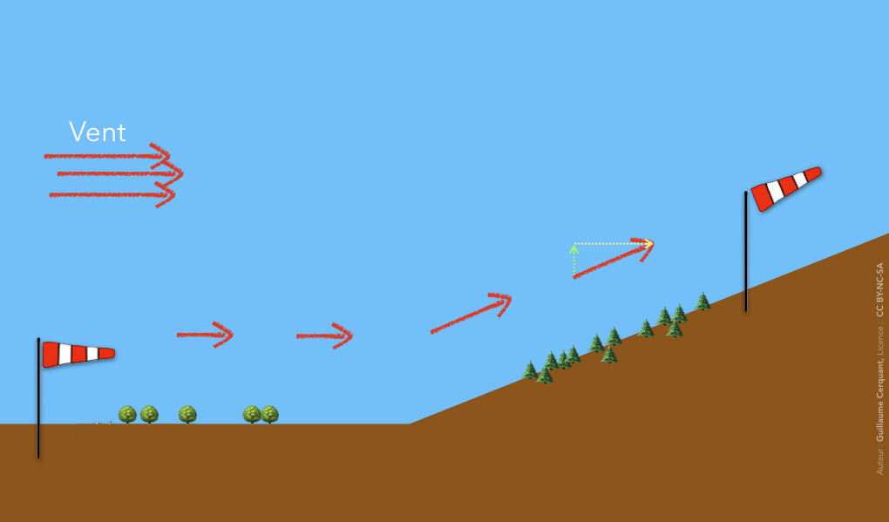

<!--
A78V
Une ascendance dynamique pure résulte :

de la dilatation de l'air lorsqu'il monte le long de la pente-6

de l'accélération du vent au sommet d'une montagne-6

de la déviation vers le haut du vent par un obstacle
-->

*ascendance* = *qui monte*  
*dynamique* = *avec du mouvement*

Donc une ***ascendance dynamique***, **c'est de l'air qui <u>monte</u> grâce à son <u>mouvement</u> initial**.

### Comment obtenir une ascendance dynamique ?

Et comme le vent est normalement horizontal ↔️, pour qu'il monte il faut qu'un obstacle l'y force ↗️.  
L'idéal ? Une belle pente montagneuse.

## Oui… mais !? 🧐🤨🥺🤯

### L'air se dilate en montant en altitude

<code>Une ascendance dynamique pure <b><mark>résulte</mark></b> :   
❌ <strike>de la dilatation de l'air lorsqu'il monte le long de la pente</strike></code>

Oui, l'air se dilate en montant en altitude (à cause de la diminution de la pression).  
Oui, <mark>mais</mark> : cette dilatation est la conséquence de l'ascendance, pas la cause.

### L'air accélère au sommet d'une montagne

<code>Une ascendance dynamique pure <b><mark>résulte</mark></b> :   
❌ <strike>de l'accélération du vent au sommet d'une montagne</strike></code>

Oui, en rencontrant une montagne, l'air accélère (par effet Venturi).  
Oui, <mark>mais</mark> : cette accélération est la conséquence de la déviation du vent par la montagne, pas la cause de l'ascendance.

## Quel autre type d'ascendance ? 

L'autre type d'ascendance que les parapentistes aiment est l'*ascendance thermique* (ou juste “thermique”).

Un thermique est causé par la convection de l'air chaud : l'air chaud, plus léger que l'air froid, monte. Et notre parapente avec.

