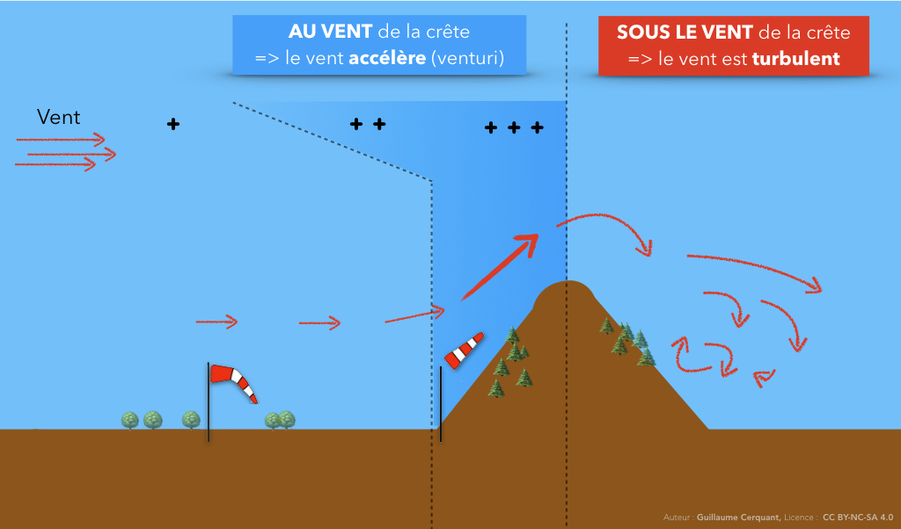
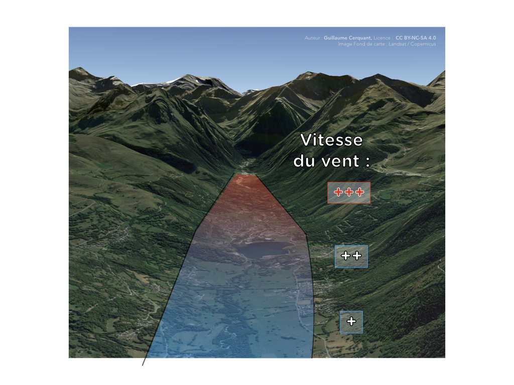
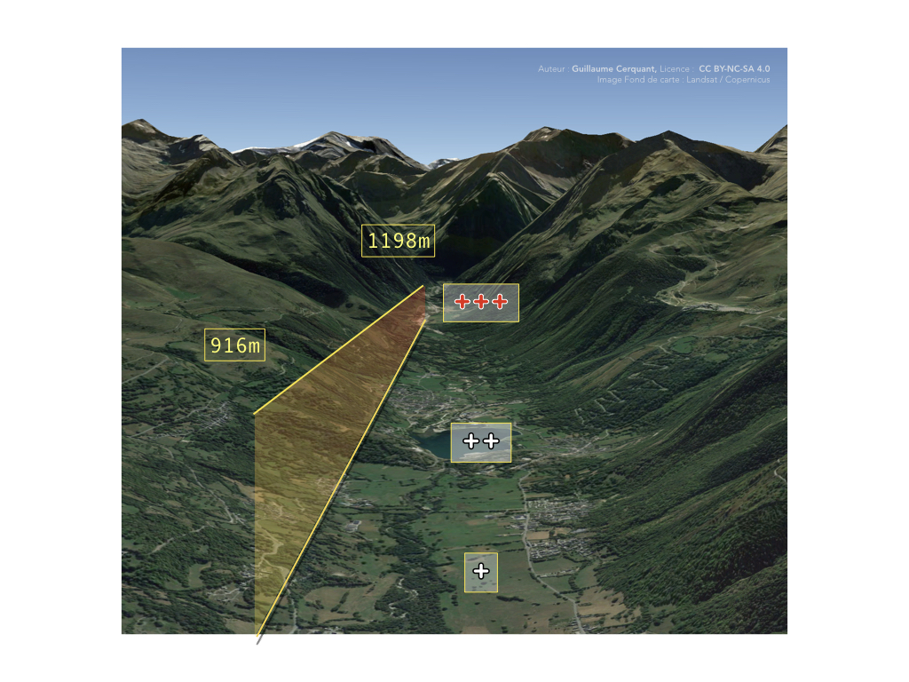
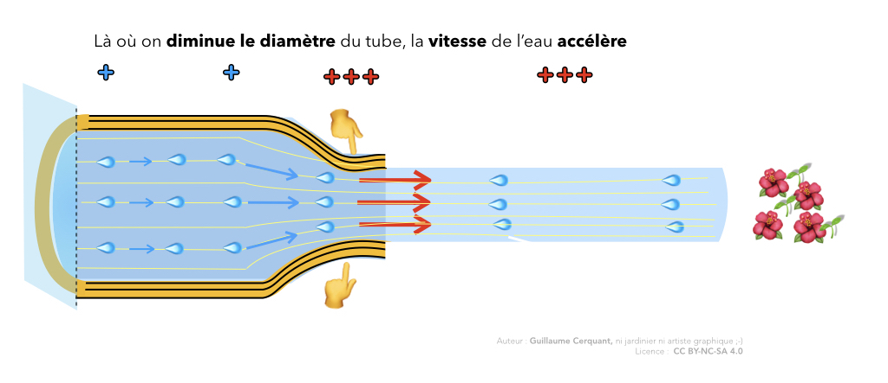
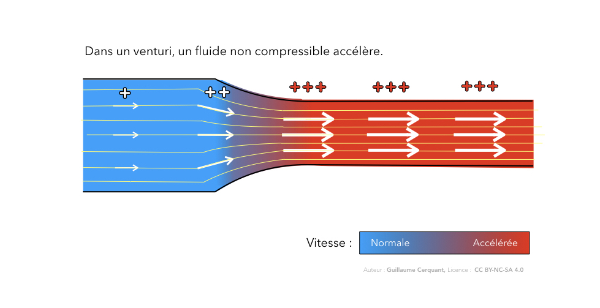
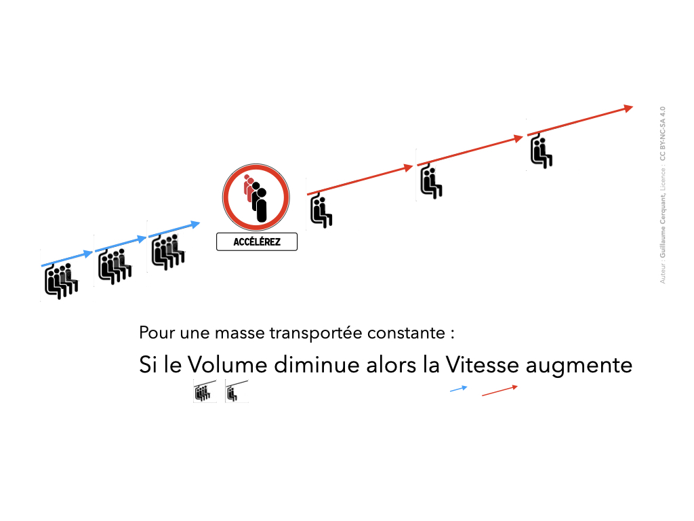
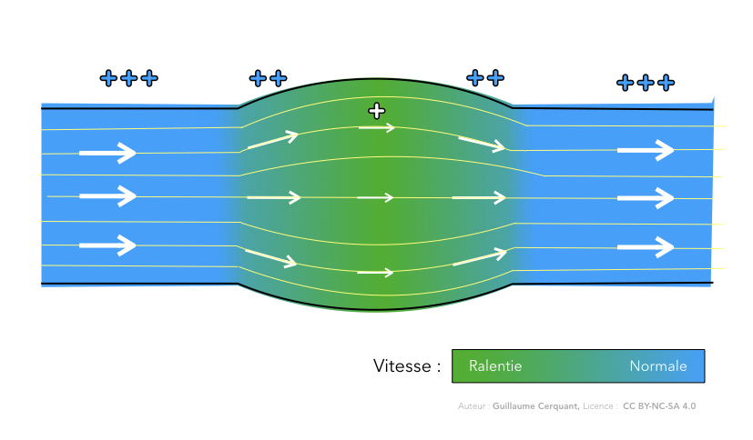

<!--
A80V
Le vent peut devenir dangereux notamment :
dans le fond de vallée, là où il s'accélère (venturi) 2
près des crêtes (risque d'être emporté sous le vent) 2
dès que sa vitesse se rapproche de celle de l'aile 2
-->

## Vitesse d'une aile
Une aile de parapente vole à environ 35km/h.
  
✅ Si le vent souffle à la même vitesse, quand tu voles face au vent, par rapport au sol, tu fais du surplace.  
Pas la meilleure définition du mot confort.

Et si tu voles dans l'autre direction (dos au vent), tu voles à 70km/h sol. Tout aussi dangereux.

Enfin, pour le petit futé qui ne se sent pas concerné car son parapente a un accélérateur : tu gagnes seulement 5km/h.  
Et ton aile a plus de chance de fermer.

# Accélération du vent
## Par une crête

Une crête va modifier le vent de plusieurs façons :

* **sous le vent d'une crête, le vent est turbulent.**  
C'est un endroit clairement à éviter.

Et là où il faut être prudent :  

* **une crête accélère le vent** (par effet venturi).  

Donc si on combine ces deux informations :  
✅ <mark>une crête **accélère le vent** et risque de nous déporter dans une **zone fortement turbulente**</mark>.

## En fond de vallée

Dans le fond de vallée, les montagnes se resserrent. Ce venturi entraine une accélération du vent.

Même si la vallée ne rétrécit pas en largeur, elle peut rétrécir en hauteur :

 
   

# 🧠👩🏻‍🔬🔬🌡🧪📐 La minute science : “explique-moi l'effet Venturi”

### Démonstration du phénomène

  
<caption>Photo par [Amy Stanley](https://www.flickr.com/photos/aboutamy/9393569695/in/photolist-9Hay2p-5dnjLH-6TE2Vb-czV39-bWEfto-fdouxm-4YFj2K-dNgwy-wVkkh1-8yn5pL-9cqrvU-quhKMv-5gpgT4-eSJoC3-7merpt-9X6tiq-dg4ToL-feetQ-Jmff85-5755Kc-dBkohL-7jE2oQ-7xrQVV-9NdTNd-PZipX-qya7Ci-fj5v1c-JbZjq7-91RmJq-38Ci3k-31tF6h-8dCYum-dFeJuJ-54aHxh-ifa6kf-2huut8d-2hBwFas-e8cwqf-9JuJd4-2huuyrj-T9kWY-jwNXFr-cdnvHd-e12KRb-6sLKoW-2hur7XW-7Virvq-zyBZjA-T9kYh-2hur3MM), licence CC BY 2.0</caption>

Quand on **presse** un tuyau d'arrosage, l'eau **accélère**.  
Donc elle atterrit plus loin.

Pourquoi ?

C'est du à l'**effet Venturi**.

### Explication physique

Lorsque de l'**air** passe par un **goulet d'étranglement** (ou *venturi*), il **accélère**.    

**Théorème simplifié** (pour un fluide non compressible) :  
Si on veut conserver en sortie du <mark>venturi</mark> la <mark>même masse</mark> de fluide qu'en entrée, il faut **accélérer la vitesse**.  

Imaginez un télésiège.  
Le premier tronçon a 4 places par nacelle.  
Le deuxième tronçon est réduit à seulement 2 places par nacelle.

Pour éviter les embouteillages à la jonction sans comprimer nos passagers, il faut doubler la vitesse du tronçon supérieur.  

À noter : 
On parle d'effet Venturi, mais c'est un abus de langage. Cette accélération est due au principe de conservation de la masse.  
L'effet Venturi est un phénomène de dépression lié à l'accélération.

<!-- 
### Raison

Oh joie, oh miracle du monde moderne (ou juste, logique de la physique !), le même effet a lieu à l'envers :  
Quand de l'air passe dans une section qui s'élargit, il ralentit.

-->

