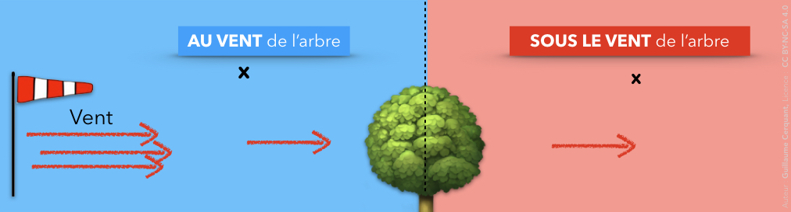
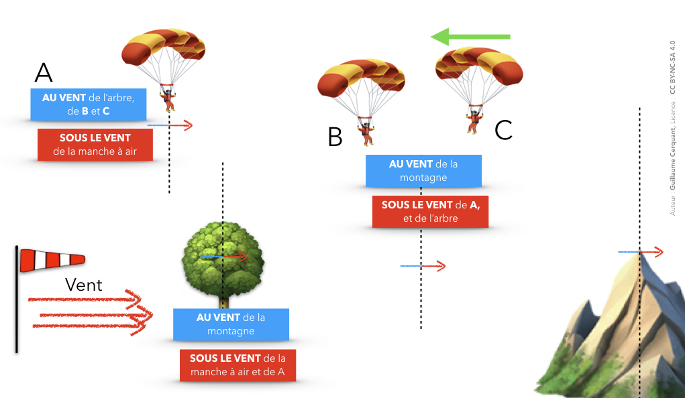
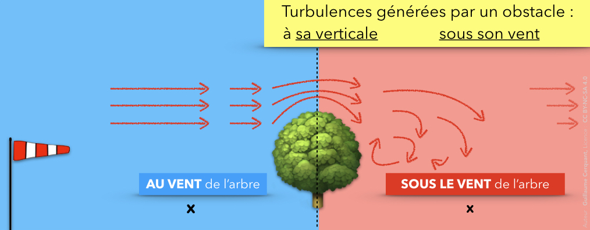
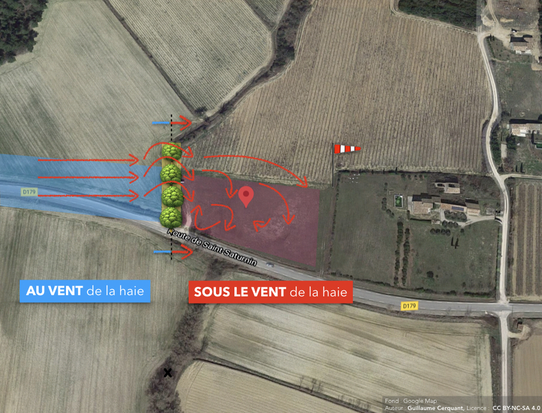

<!--
A81V
Un rideau d'arbres face au vent provoque des turbulences :
-->

# Au vent / sous le vent ? *Kezakoqueçaveutdire ?!*
## Définitions
Les notions *au vent* et *sous le vent* sont essentielles.  
Cela permet de **positionner** un objet **par rapport à un autre** en **tenant compte du sens du vent**.

### Au vent
<mark>Un objet situé **au vent** d'un autre reçoit le vent en **premier**.</mark>  

Autrement dit :  
Si un parapentiste est au vent d'un arbre, il reçoit le vent avant l'arbre.  

### Sous le vent
<mark>Un objet situé **sous le vent** d'un autre reçoit le **vent après celui-ci**.</mark>

Si ce même parapentiste est sous le vent d'un arbre, le vent va d'abord rencontrer l'arbre, puis notre chiffon volant favori.

### Sens du vent

Attention : votre sens de déplacement n'a pas d'importance.  
Ce qui compte, c'est le **sens du vent**.

De la même manière que le nord reste au même endroit quand vous tournez sur vous même, vous restez sous le vent des mêmes objets quelle que soit votre direction.

⚠️ Même si le parapentiste C vole dans le sens inverse de B, ils sont tous les deux *sous le vent* de l'arbre et *au vent* de la montagne.

# Turbulences

## À la verticale, et sous le vent

Un rideau d'arbres face au vent provoque des turbulences :

* ❌ <strike>côté au vent</strike>  
➡️ au vent, le vent n'a pas encore été perturbé par l'obstacle, il s'écoule sans tourbillons (on dit qu'il est laminaire).

* ✅ à la verticale

* ✅ sous le vent

Sous le vent d'un obstacle, il faut s'attendre à se faire secouer. Ou mieux, ne pas y aller.  

## Choix atterro
Dans un champ avec une haie d'arbre, on posera donc **au vent de cette rangée**, ou loin sous le vent.

Si [José](https://jokair-parapente.com/) —mon tout premier prof de parapente 😉👋— n'avait pas fait disparaître la haie que j'ai replanté en copiant 4 Emoji arbres, se poser à Rustrel par vent d'est serait compliqué.