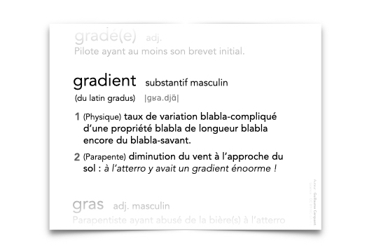
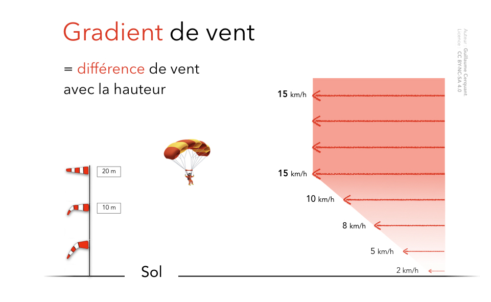
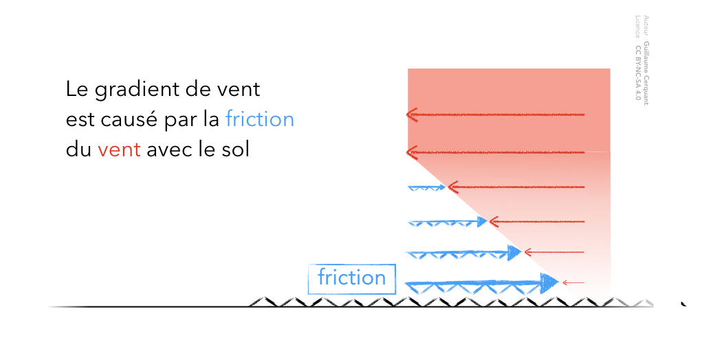
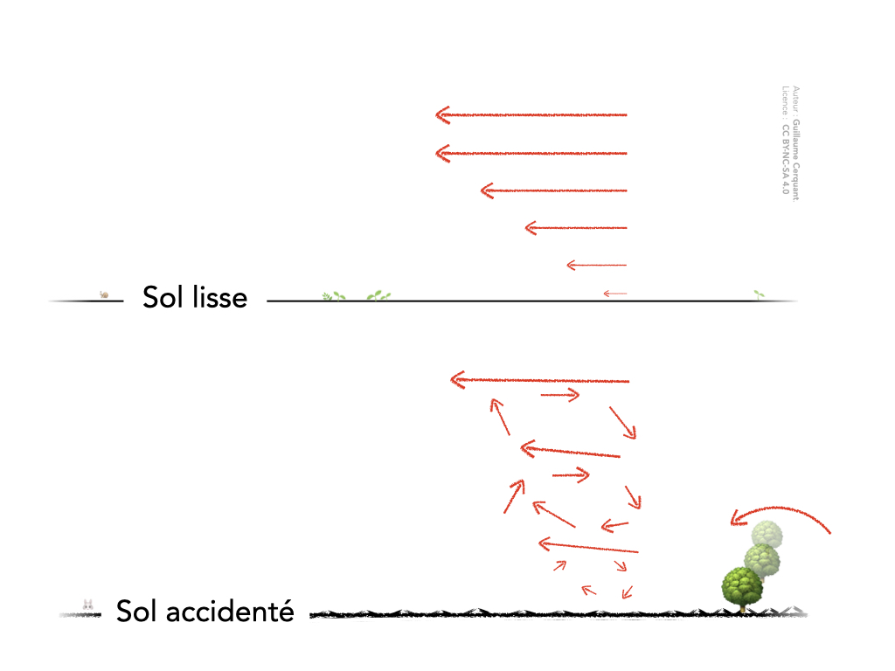

<!--
A82V
 Le gradient de vent est sensible :

sur terrain lisse et dégagé 
sur terrain accidenté où il se mélange aux turbulences2
par vent fort
-->

#  ‼️ Explication en cours de rédaction 

# Le gradient

## Définition

Le gradient (de vent) est la diminution du vent en fonction de la hauteur par rapport au sol.

## Pourquoi ?

### Friction

La **couche d'air la plus basse frotte contre le sol**. Cette friction ralentit l'air.  

L'air est un fluide visqueux.  
Cette friction se propage vers le haut, couche par couche, en diminuant progressivement.

## Intensité du gradient

Plus le vent est **fort** et sur un **terrain sans obstacle**, plus le gradient est **marqué**.

### Vent fort

Pas de vent = pas de friction  🤷‍♂️  
✅ **Vent fort** ➡️ fortes frictions ➡️ **fort gradient**

### Nature du Terrain

Sur un terrain **lisse et dégagé**, le gradient sera plus marqué.  
C'est parce que les couches d'air laminaires (sans turbulences) diffuseront moins la friction vers le haut.

Sur un **terrain accidenté**, le gradient se mélange aux turbulences.  
Même si le gradient est moins marqué, la situation n'est pas forcément plus confortable.  

# Pourquoi c'est important ?

Maintenant que vous savez ce qui se passe, observons comment votre voile va réagir.

## À l'atterrissage

En phase finale, vous devez <u>toujours</u> avoir une vitesse suffisante.  
Encore plus si vous suspectez la présence d'un gradient.

### Abattée

Lorsque l'aile va entrer dans le gradient, son vent relatif va diminuer. Elle va donc chercher à reprendre de la vitesse.
Sa seule méthode pour continuer à voler : piquer vers le bas.

Si vous n'avez pas assez de hauteur pour finir l'abattée, vous allez impacter le sol avec une vitesse verticale élevée.  
Une fois dans ce scénario, il n'y a plus de rattrapage possible.

### Décrochage

Votre changement de vitesse-air [TODO]

## Au décollage

Pour les mêmes raisons de frictions, il peut y avoir un gradient sur un décollage.

Vous pouvez avoir un  vent modéré à hauteur du visage, et le double 10 mètres plus haut.  
Si vous ne l'anticipez pas, vous risquez de vous faire emporter lorsque vous allez monter l'aile.
