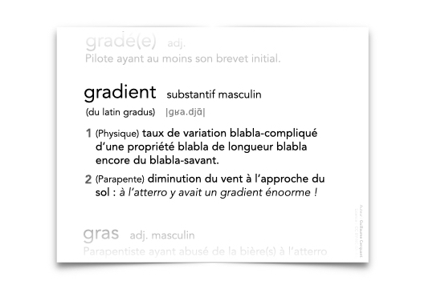
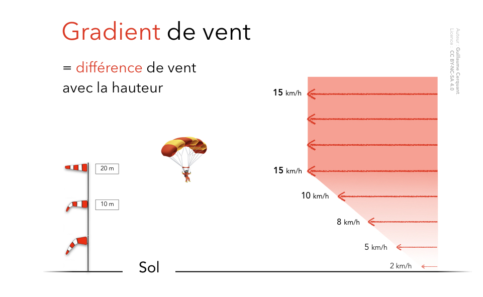
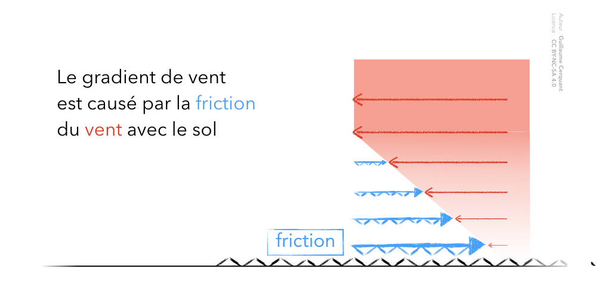

<!--
similaire to A82V
 Le gradient de vent à l'atterro :

dépend de l'état du sol

dépend de la vitesse du vent

augmente le taux de chute

vous oblige à voler plus lentement

-->

#  ‼️ Explication en cours de rédaction 

# Le gradient

## Définition

Le gradient (de vent) est la diminution du vent en fonction de la hauteur par rapport au sol.

## Pourquoi ?

### Friction

La **couche d'air la plus basse frotte contre le sol**. Cette friction ralentit l'air.  

L'air est un fluide visqueux.  
Cette friction se propage vers le haut, couche par couche, en diminuant progressivement.

## Intensité du gradient

Plus le vent est **fort** et sur un **terrain sans obstacle**, plus le gradient est **marqué**.

### Vent fort

Pas de vent = pas de friction  🤷‍♂️  
✅ **Vent fort** ➡️ fortes frictions ➡️ **fort gradient**

### ✅ Le gradient dépend de l'état du sol 

Sur un terrain **lisse et dégagé**, le gradient sera plus marqué.  
C'est parce que les couches d'air laminaires (sans turbulences) diffuseront moins la friction vers le haut.

# Pourquoi le gradient augmente le taux de chute ?

✅ En phase finale d'atterrissage, vous devez toujours avoir une vitesse suffisante, car le gradient augmente votre taux de chute (ou vitesse verticale). 

## Abattée

Lorsque l'aile va entrer dans le gradient, son vent relatif va diminuer.  
Elle va donc chercher à **reprendre de la vitesse**.
Sa seule méthode : piquer vers le bas.

À noter, si vous n'avez pas assez de hauteur pour finir l'abattée, vous allez impacter le sol avec une vitesse verticale élevée.  
Une fois dans ce scénario, il n'y a plus de rattrapage possible.

[todo : schéma]

## Perte de portance

Le deuxième impact de la diminution du vent relatif causée par le gradient : la portance (la force qui vous tient en l'air) va diminuer.
  
Vous allez donc descendre plus vite.

Si votre vitesse (et donc votre portance) diminue trop, vous risquez même de décrocher.

[todo : schéma]

  

`❌ vous oblige à voler plus lentement`  
=> ⚠️ les basses vitesse sont à bannir près du sol !

 
## Bras hauts en finale 🤷

En finale, vous **devez** avoir une vitesse suffisante.  
En plus de vous permettre d'avoir de l'énergie à dissiper pour obtenir un bel arrondi, cela vous permettra d'éviter les “désagréments” d'un éventuel gradient.

