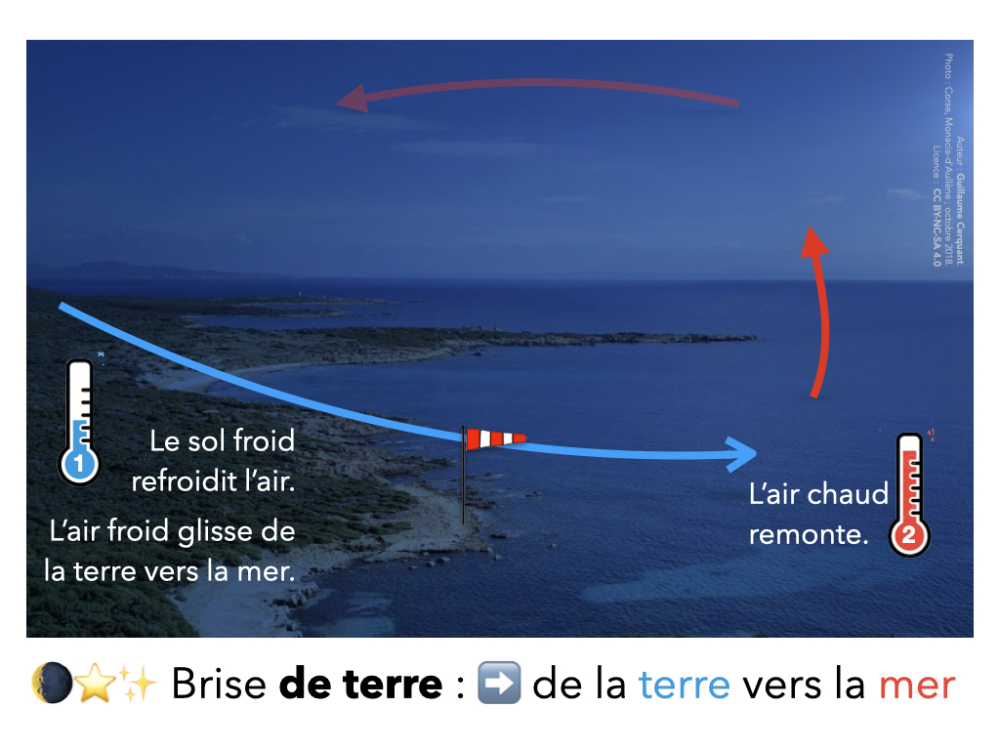

<!--
A87V (similar: A88V)
Par beau temps, la brise de mer souffle lorsque :
-->

Les brises de mer et de terre résultent de la **différence de température** entre la mer et la terre.  

L'air dans la région chaude s'élève et crée un appel d'air au sol depuis la région plus froide.  
Une boucle de retour s'établit en altitude.

## ✅ Brise de mer

L'eau de la mer absorbe une partie de la chaleur du rayonnement solaire.  
✅ Donc en journée, la **terre chauffe plus que la mer**.  

La terre réchauffe l'air à son contact (conduction), qui monte (convection).  
Là où l'air était avant de monter, il y a maintenant une pression plus faible. Et la nature a horreur du vide.

L'air froid venu de la mer vient le remplacer. C'est la **brise de mer**.

En montant en altitude, l'air chaud se refroidit par dilatation, et retourne en mer.

## Brise de terre

La brise de terre fonctionne à l'identique.  

La mer a une plus grande inertie thermique, et donc se refroidit plus lentement que la terre.  
Donc la nuit, **la mer est plus chaude que la terre**.

L'air froid de la terre va glisser vers la mer, et chasser l'air plus chaud qui s'y trouvait en altitude.

## Résumé vidéo

<video controls="" width="640">
<source src="https://static1.mclcm.net/images/publicator_2009/videotheque/publie/lcm_episodique/web/2013/06/ACTU_20130625_18H_BRISE_H264.mp4?ts=20130625180000" type="video/mp4">
Désolé, vous navigateur ne supporte pas le HTML5.
</video>

<figcaption>via [lachainemétéo](https://www.lachainemeteo.com/videos-meteo/actualites-france/brise-de-mer-et-beau-temps-120147)</figcaption>
    
    

# Pour une poignée de détails <i>!</i>

## La marée a t'elle une influence ?

❌ <strike>la marée est descendante</strike>  
➡️ la marée n'a rien à voir dans le phénomène de brise, ni de terre ni de mer.

## Horaires 🚍🚏

La brise de mer s'installe en général en début d'après-midi, car il y a un peu d'inertie pour que la terre et l'air à son contact soient réchauffés par le soleil.

La brise de terre débute quelques heures après le coucher du soleil. 

*<small>(Horaires hors vacances et jours fériés).</small>*

## Conditions d'installation

La brise de mer s'établit près des côtes :

* par beau temps : besoin d'une activité thermique
* absence de vent météo : pas de mélange des masses d'air, qui permet d'arriver à un gradient de température
* elle s'étend assez peu vers le large (rarement plus de 5km).

## Flux laminaire

<figcaption>Auteur : Guillaume Cerquant. Photo : Corse, Propriano ; octobre 2018.
Licence : CC BY-NC-SA 4.0</figcaption>

La brise de terre reste assez modérée en intensité.

La brise de mer peut être relativement forte (jusqu'à 6 sur l'échelle de Beaufort).  
Son flux est **laminaire** (sans turbulences), car il ne rencontre aucun obstacle avant d'arriver sur les côtes.

<figcaption>[Dune du Pilat](https://www.dunedupilat.com/fr/la-dune/parapente/)</figcaption>

<figcaption>[Dune du Pilat](https://www.dunedupilat.com/fr/la-dune/parapente/)</figcaption>
