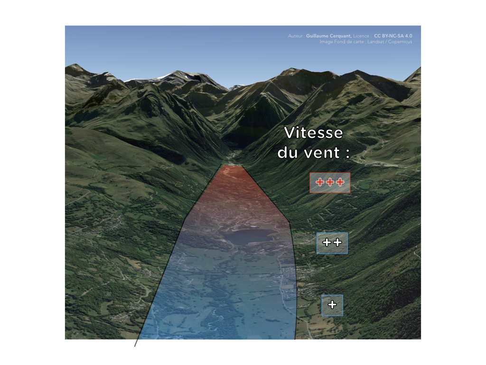
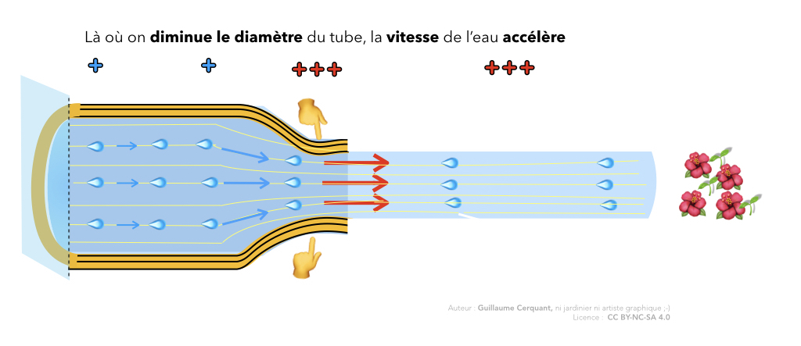
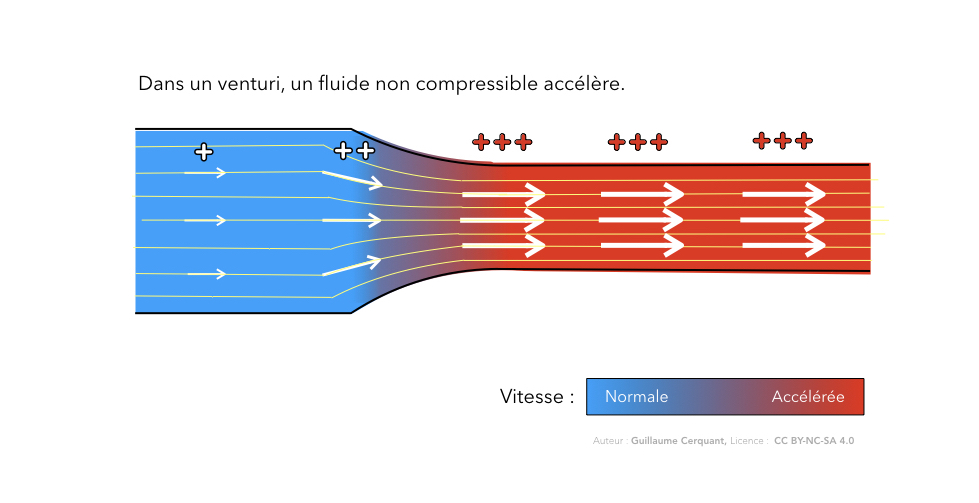
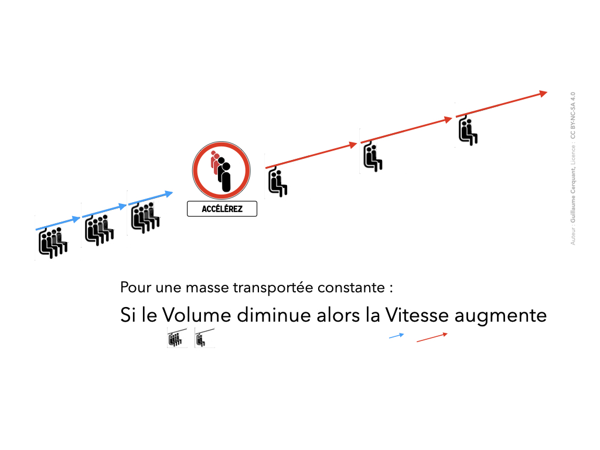

<!--
A93V
Une brise de vallée :

peut dépasser facilement les 30 km/h en été2

se manifeste parfois sur plusieurs milliers de mètres d'épaisseur-6

accélère quand la vallée se resserre2

augmente quand on descend dans la basse couche
-->

# Phénomène de brise

<mark><b>en cours de rédaction</b></mark>

Les brises résultent d'une **différence de température**. 

## Brise de pente

Sous l’action du rayonnement solaire le sol s’échauffe et communique par
conduction cette chaleur à l’air qui se trouve le long du relief.
L’air réchauffé et donc plus léger s’élève le long de la pente : c’est la brise
de pente montante.
Cet air ascendant est remplacé par de l’air dit « libre », plus froid en
provenance de la vallée ou de versants non exposé au soleil.
Ces brises de pente peuvent atteindre 15 à 30 km/h sur une épaisseur de
100 à 200m.

## Brise de vallée

Les brises de vallées s’installent entre la plaine et les vallées. Elles sont
également montantes le jour et descendantes la nuit.
Les brises de vallées sont dues au réchauffement des volumes d’air
présents sur les plaines et dans les montagnes dans des proportions
inégales. En effet un volume d’air plus important se réchauffe dans les
montagnes durant la journée.
Ces brises de pente ou de vallée peuvent être renforcées ou détournées
par le vent météo ce qui peut donner naissance à des turbulences de
confluence.
Les brises de pente montantes s’installent dès les premiers rayons de
soleil. Leur intensité est croissante jusqu’en milieu de journée puis décroît
jusqu’au coucher du soleil.

La brise de vallée atteint son paroxysme également en milieu de journée
où elle peut atteindre se manifeste parfois sur plusieurs milliers de mètres d'épaisseur 15 à 35 km/h (voir plus selon les formes de vallées)
✅  sur une épaisseur de 200 à 500m, elle peut rendre le vol en parapente
impossible.
Attention : Les brises de vallées peuvent donc être un piège pour les
libéristes ! Il est important d’observer attentivement ces phénomènes afin
d’anticiper leur évolution. 
2
En fin de journée, quand le soleil décline le sol se refroidit et l’air à son
contact devient plus froid et donc plus lourd, il s’écoule le long du relief.
Ce phénomène se généralise au coucher du soleil, ce sont les brises
descendantes.
En soirée et toute la nuit l’on observe des brises de pente descendantes
vers les plaines.

Lorsque le soleil, par rayonnement, chauffe le sol des versants qui lui sont exposés, ce sol va à son tour réchauffer la couche d'air qui est en contact avec lui. Cette couche d'air va se dilater, donc peser moins lourd pour un même volume que l'air environnant et va donc avoir tendance à monter. Si une petite surface, donc un faible volume d'air, est réchauffée fortement, nous obtiendrons un thermique. Cependant, le cas le plus courant correspond souvent à une grande surface de pente exposée à un rayonnement moyen. L'air, à ce moment-là, n'aura pas une concentration d'énergie suffisante pour se détacher du sol et monter dans l'atmosphère à la verticale. Il aura tendance à "coller" sur la pente par effet de viscosité statique, un petit peu comme un lainage sur du "velcro". Si tout un versant est ainsi exposé au soleil, à chaque endroit de la pente les particules d'air vont "couler" en remontant jusqu'à la crête, d'où elles devront effectivement se détacher du sol pour poursuivre leur ascension. A leur place initiale, elles seront remplacées par un appel d'air depuis le bas de la pente :

http://www.grandvol.com/FFP-manuel/ar_09.htm

<iframe width="560" height="315" src="https://www.youtube.com/embed/Cpwf8Qazy_0?start=100" frameborder="0" allow="accelerometer; autoplay; encrypted-media; gyroscope; picture-in-picture" allowfullscreen></iframe>

À partir de 1:40

# Vitesse d'une brise de vallée

Dans une vallée parfaitement lisse et de ligne de crête rectiligne, en théorie ce déplacement d'air pourrait être laminaire.  
La vraie vie est bien plus intéressante. Tous les reliefs et obstacles vont modifier le flux d'air. À cette vitesse, des flux d'air sont inévitables.

Attention à ne pas vous retrouver sous le vent d'une des crêtes. 

## Dans les basses couches

Confort en l'air, et trop quand tu veux poser.

## Accélération en fond de vallée (par venturi)

<mark><b>en cours de rédaction</b></mark>
Dans le fond de vallée, les montagnes se resserrent. Ce venturi entraine une accélération du vent.

 
   

# 🧠👩🏻‍🔬🔬🌡🧪📐 La minute science : “explique moi l'effet Venturi”

### Démonstration du phénomène

  
<caption>Photo par [Amy Stanley](https://www.flickr.com/photos/aboutamy/9393569695/in/photolist-9Hay2p-5dnjLH-6TE2Vb-czV39-bWEfto-fdouxm-4YFj2K-dNgwy-wVkkh1-8yn5pL-9cqrvU-quhKMv-5gpgT4-eSJoC3-7merpt-9X6tiq-dg4ToL-feetQ-Jmff85-5755Kc-dBkohL-7jE2oQ-7xrQVV-9NdTNd-PZipX-qya7Ci-fj5v1c-JbZjq7-91RmJq-38Ci3k-31tF6h-8dCYum-dFeJuJ-54aHxh-ifa6kf-2huut8d-2hBwFas-e8cwqf-9JuJd4-2huuyrj-T9kWY-jwNXFr-cdnvHd-e12KRb-6sLKoW-2hur7XW-7Virvq-zyBZjA-T9kYh-2hur3MM), licence CC BY 2.0</caption>

Quand on **presse** un tuyau d'arrosage, l'eau **accélère**.  
Donc elle atterrit plus loin.

Pourquoi ?

C'est du à l'**effet Venturi**.

### Explication physique

Lorsque de l'**air** passe par un **goulet d'étranglement** (ou *venturi*), il **accélère**.    

**Théorème simplifié** (pour un fluide non compressible) :  
Si on veut conserver en sortie du <mark>venturi</mark> la <mark>même masse</mark> de fluide qu'en entrée, il faut **accélérer la vitesse**.  

Imaginez un télésiège.  
Le premier tronçon a 4 places par nacelle.  
Le deuxième tronçon est réduit à seulement 2 places par nacelle.

Pour éviter les embouteillages à la jonction sans comprimer nos passagers, il faut doubler la vitesse du tronçon supérieur.  

À noter : 
On parle d'effet Venturi, mais c'est un abus de langage. Cette accélération est du au principe de conservation de la masse.  
L'effet Venturi est un phénomène de dépression lié à l'accélération.

