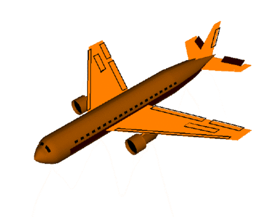
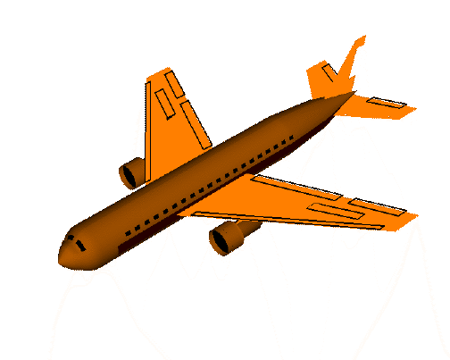
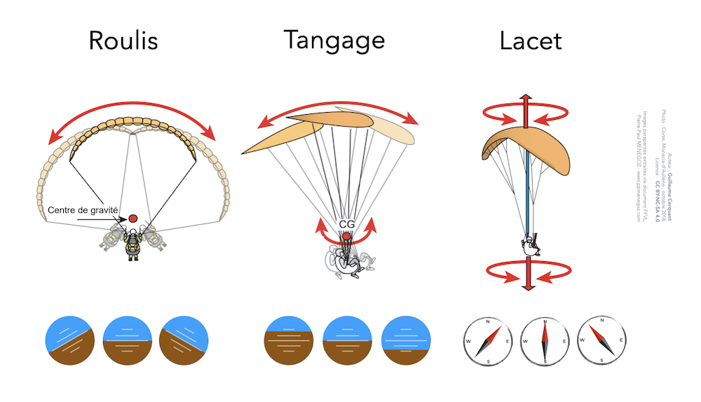
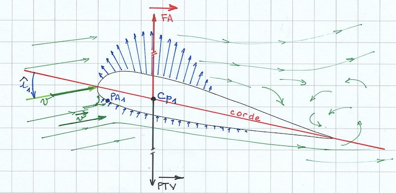

<!--
E24V
Une aile peut pivoter autour des axes de :
lacet, tangage, roulis 
X corde
-->

<!-- /usr/local/bin/pandoc --css /Users/gc/Desktop/qcmffvl/qcmffvl/web/answers/pandoc.css  --resource-path /Users/gc/Desktop/qcmffvl/qcmffvl/web/answers/BI/E24V /Users/gc/Desktop/qcmffvl/qcmffvl/web/answers/BI/E24V/explanation.md --output=/Users/gc/Desktop/qcmffvl/qcmffvl/web/answers/BI/E24V/explanation.md.html -->

# 3 axes de pivot

En aéronautique, on nomme les rotations autour des 3 axes **tangage**, **roulis**, et **lacet**.

<!-- converted from gif to mp4 via https://rigor.com/blog/optimizing-animated-gifs-with-html5-video
ffmpeg -i animated.gif -movflags faststart -pix_fmt yuv420p -vf "scale=trunc(iw/2)*2:trunc(ih/2)*2" video.mp4

<b>Tangage :</b> <video autoplay="autoplay" loop="loop">
  <source src="pitch.mp4" type="video/mp4" />
</video>
<b>Roulis :</b> <video autoplay="autoplay" loop="loop">
  <source src="roll.mp4" type="video/mp4" />
</video>
<b>Lacet :</b> <video autoplay="autoplay" loop="loop">
  <source src="yaw.mp4" type="video/mp4" />
</video>

<figcaption>
	<a href="https://commons.wikimedia.org/wiki/File:Aileron_yaw.gif" title="via Wikimedia Commons">NASA</a> / Public domain
</figcaption>

-->

<b>Tangage :</b> 

 
<b>Roulis :</b>
 
 
<b>Lacet :</b>    

Une aile de parapente peut pivoter autour de ces 3 axes.  
Elle aura :

- du tangage (avant-arrière)
- du roulis (gauche-droite)
- un mouvement de lacet

## Tangage

Le tangage est un mouvement de rotation qui va me faire piquer ou cabrer.  
Un bateau qui rencontre des vagues **de face** va tanguer.

En parapente si vous tanguez, vous voyez successivement l'horizon, le ciel, l'horizon, le sol…  
L'aile va passer derrière le pilote, au dessus de sa tête, devant…

Faire une <u><mark>T</mark></u>empo, c'est contrôler son aile sur l'axe de <u><mark>T</mark></u>angage.

<video controls width="960" height="540" poster="https://www.pilotage-parapente.com/wp-content/uploads/2016/01/ROULIS-sommaire_thumb1382.jpg" src="https://www.pilotage-parapente.com/wp-content/uploads/2016/01/ROULIS-sommaire.mp4?_=1" style="width: 801.891px; height: 451.064px;"><source type="video/mp4" src="https://www.pilotage-parapente.com/wp-content/uploads/2016/01/ROULIS-sommaire.mp4?_=1"></video>
<figcaption>Via le <a href="https://www.pilotage-parapente.com/manuel-de-pilotage/sommaire/le-pilotage-pendulaire/pendulaire-roulis/">manuel Pilotage Parapente</a>, de David Eyraud (je recommande vivement !!)</figcaption>

<video controls width="960" height="540" poster="https://www.pilotage-parapente.com/wp-content/uploads/2016/01/TANGAGE-sommaire-v2_thumb9.jpg" src="https://www.pilotage-parapente.com/wp-content/uploads/2016/01/TANGAGE-sommaire-v2.mp4?_=1" style="width: 801.891px; height: 451.064px;"><source type="video/mp4" src="https://www.pilotage-parapente.com/wp-content/uploads/2016/01/TANGAGE-sommaire-v2.mp4?_=1"></video>
<figcaption>Via le <a href="https://www.pilotage-parapente.com/manuel-de-pilotage/sommaire/le-pilotage-pendulaire/pendulaire-tangage/">manuel Pilotage Parapente</a>, de David Eyraud</figcaption>

## Roulis

Mouvement de rotation latérale (à gauche, à droite).

Un bateau qui est frappé **de côté** par la houle va subir du roulis.

## Roulis et Tangage sont sur un radeau…

“… attends, rappelle moi, c'est qui déjà Roulis et c'est qui Tangage ?”
 
— “Roulis, il roule, et Tangage il tan…” 
— “…” 
— “Ok. Roulis, il roule. Comme dans ta voiture : si tu mets des coups de volant rapides, tu vas à gauche puis à droite”

 

## Lacet

Mouvement de rotation autour de l'axe vertical : changement de direction du nez.

## Au clair sur les 3 axes ?

	
<input type="checkbox" id="E24V-q1" class="toggle visually-hidden">
Lors du décollage, une tempo va permettre de contrôler l'aile sur l'axe de : 

Tangage

Roulis

Lacet 

 
<label for="E24V-q1">Voir la réponse</label>

 
 

<input type="checkbox" id="E24V-q2" class="toggle visually-hidden">
Pour tourner, en baissant une seule commande je vais déclencher un mouvement sur les axes de (2 bonnes réponses) : 

Tangage

Roulis

Lacet 

  
<label for="E24V-q2">Voir les réponses</label>

 
 

<input type="checkbox" id="E24V-q3" class="toggle visually-hidden">
Une ressource et une abattée sont des mouvements sur l'axe de : 

Tangage

Roulis

Lacet 

  
<label for="E24V-q3">Voir la réponse</label>
    

 
 

<input type="checkbox" id="E24V-q8" class="toggle visually-hidden">
Lors du gonflage, quand mon aile va s'orienter face au vent par effet girouette, elle tourne sur l'axe de : 

Tangage

Roulis

Lacet 

  
<label for="E24V-q8">Voir la réponse</label>

 
 

<input type="checkbox" id="E24V-q9" class="toggle visually-hidden">
Lors du gonflage, quand je me décale de côté, c'est pour contrôler le mouvement de : 

Tangage

Roulis

Lacet 

  
<label for="E24V-q9">Voir la réponse</label>

  

<input type="checkbox" id="E24V-q4" class="toggle visually-hidden">
Une clef sur une suspente avant ("les A") va créer un mouvement sur les axes de (2 bonnes réponses) : 

Tangage

Roulis

Lacet 

  
<label for="E24V-q4">Voir les réponses</label>

 
 

<input type="checkbox" id="E24V-q5" class="toggle visually-hidden">
Pour tourner, en baissant une seule commande je vais déclencher un mouvement sur les axes de (2 bonnes réponses) : 

Tangage

Roulis

Lacet 

  
<label for="E24V-q5">Voir les réponses</label>
	

 
 

<input type="checkbox" id="E24V-q6" class="toggle visually-hidden">
Si mon aile me dépasse et ferme, c'est parce que je n'ai pas contrôlé son : 

Tangage

Roulis

Lacet 

  
<label for="E24V-q6">Voir la réponse</label>

Alors ce quizz ? *Ça roule ? <i>AH AH AH !</i>*  
(Pfff, oui, bon, ça va, si on peut plus rien dire aussi 🙎‍♂️)

# Corde

❌ La corde n'est pas un axe de rotation.  

La corde est la droite entre le bord d'attaque et le bord de fuite.

<figcaption>Extrait du référentiel BPC FFVL</figcaption>