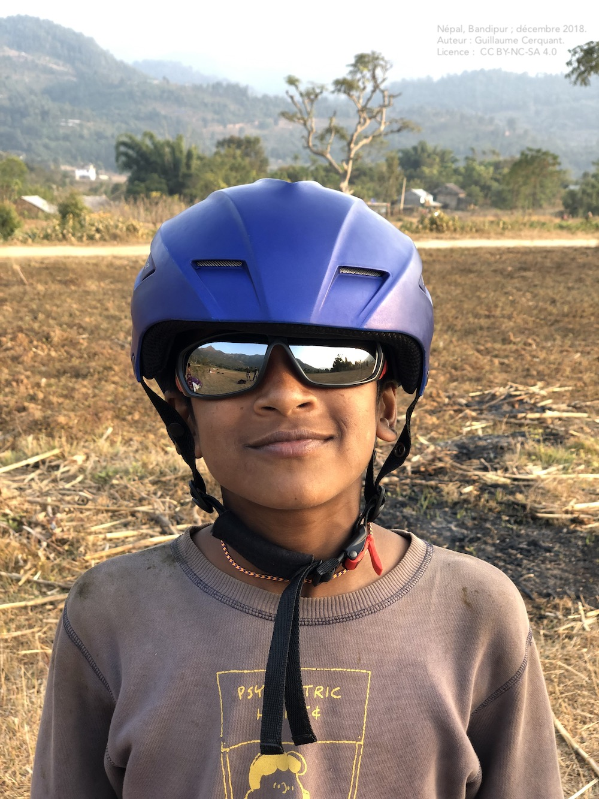

<!--
A22V
-->

## On a qu'une tête ;-)

 

 
### *Dans le doute, <mark>sécurité == bonne réponse</mark>* 😉 *!*

 

Un bon casque ne doit pas être gênant : ne pas perturber la vue (!) ou l'audition (permet "d'entendre" la vitesse de vol), et être léger et résistant.  

Sa décoration n'importe pas 🤷.  
Si son attache est un velcro, changez de magasin.

##  

Un casque est obligatoire : 

- en **école**
- pour le **passager d'un vol bi-place**  
- en **compétition**
- si imposé par arrêté préfectoral

##  

Un casque de parapente doit être **conforme à la norme EN 966 6**.  

Les autres casques (escalades, ski, spéléo, vélo, *moto!*) ne sont pas appropriés au vol libre.

Cette norme impose :

- une enveloppe "composite" **anti-poinçonnement** (en cas de contact avec un objet pointu ou acéré)
- une mousse absorbante (confort et absorption de l'énergie en cas de choc)

Ce qu'en [dit la FFVL](https://federation.ffvl.fr/actus/casques).