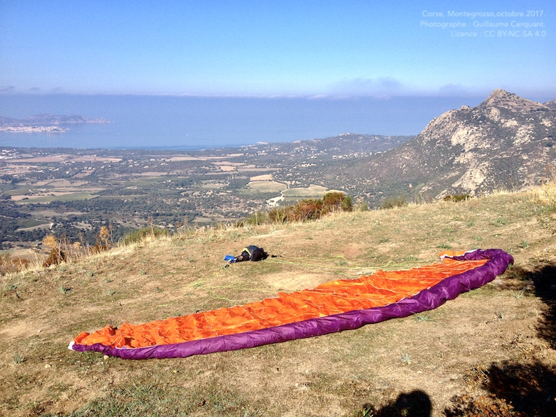
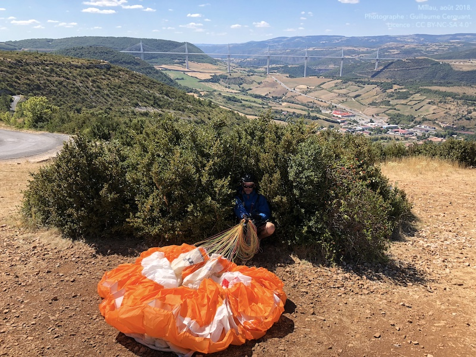

<!--L3V, N26V, N27V
Lors du stockage ou du transport, un parapente ou un parachute de secours doit être protégé du voisinage ou du contact :)
N27V:  Citez les facteurs de vieillissement pour une aile :-->

Nos parapentes et parachutes de secours sont des petits êtres tout sensibles et délicats 🥺.

### Stockage de l'aile
Il faut donc tenir son aile à l'abri du :

* **rayonnement solaire** ➡️ on la laisse pas cuire 2h étalée à l'attero
* l'**humidité** et la **chaleur** ➡️ on évite de la stocker à la cave, ou la laisser dans le coffre en plein soleil 🚐 ☀️ 🌡 pendant la sieste avant de retourner voler
* les liquides divers, qui vont affecter la porosité et la résistance

  

   

### Entretien du parapentiste

Il est également conseillé de ne pas laisser cuire trop longtemps le pilote.

<figcaption>Temps de cuisson conseillé pour un croustillant idéal : 20 minutes à 180℃</figcaption>

### Utilisation

Un autre facteur de vieillissement est d'appliquer les techniques de descente rapide.  
Cela va entraîner des charges supérieures aux conditions d'utilisation prévue.  

Les turbulences ne sont **pas** un facteur de vieillissement prématuré.

