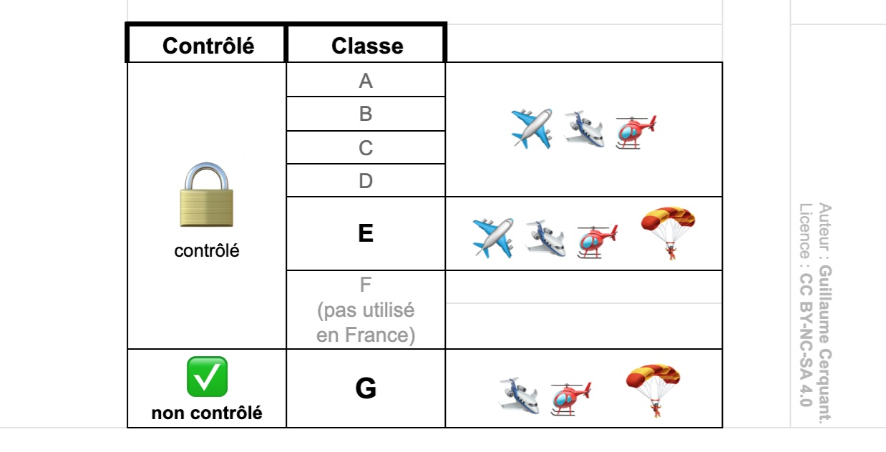
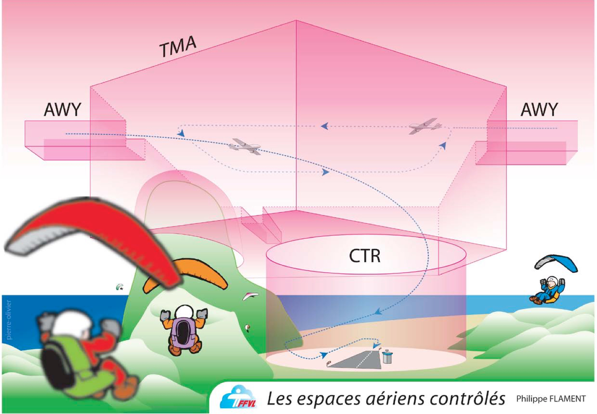

<!--
S109V
Citez un schéma possible, d’organisation des espaces, autour d’un aéroport.
-->

## Espaces aériens français

### Les classes d'espaces aériens

🔒En France, les **espaces aériens controlés sont classés de A à E**.  
🔓L'espace **non controlé est classé G**.  

*La classe F n'est pas utilisée en France.*

### 🪂 Dans quelles classes parapenter ?

Les parapentes, considérés comme des planeurs ultralégers (PUL) peuvent évoluer uniquement en espace de classe E (contrôlé) et G (non contrôlé).

## Types de zone

### CTR

**CTR** = (de l'anglais *control zone*, ou *control traffic region*)  
**Zone controlée autour d'un aérodrome** pour protéger les vols à l'arrivée ou au départ.  
Cette zone s'étend verticalement depuis le sol.

Une CTR est généralement de classe D.

✅ En France depuis 2007, **la classe E n'est plus utilisée pour une CTR**.  
➡️ les 2 réponses commencant par "CTR de classe E" sont fausses, il ne reste plus qu'une réponse valide.

### TMA
Une TMA est une zone de manœuvre terminale (terminal manoeuvring area).

C'est une zone qui permet de rejoindre une CTR.  
Contrairement à une CTR, une TMA ne touche pas le sol. Sa limite inférieure ne peut pas être en dessous de 200 mètres.

Une TMA peut être de classe A à E ; en France, elles sont majoritairement classées D ou E.

### *– Euh, t'es mignon, mais tu veux pas me faire un dessin ? 🐑*

Dans ce schéma, un avion :

* Navigue d'une ville à l'autre via un couloir aérien (**airway**, ou AWY).  
* Puis, descends en altitude via une **zone de manœuvre terminale** (TMA).  
On note que la TMA ne touche pas le sol.
* Enfin pénètre dans une **control zone** (CTR) afin d'atterrir sur un aéroport.  
La CTR touche le sol.

