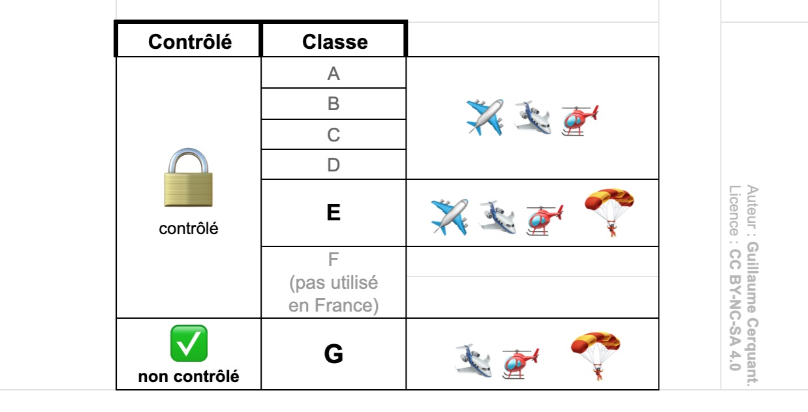

<!--
S110V
Quelles classes d’espace sont accessibles au vol libre ? - F (à l'étranger) et G
-->

## Espaces aériens français

### Les classes d'espaces aériens

🔒En France, les **espaces aériens controlés sont classés de A à E**.  
🔓L'espace **non controlé est classé G**.  

*La classe F n'est pas utilisée en France.*

### 🪂 Dans quelles classes parapenter ?

Les parapentes, considérés comme des planeurs ultralégers (PUL) peuvent évoluer uniquement en espace de classe E (controlé) et G (non controlé).

La réponse valide est donc correcte, même si incomplète.  
Elle a sûrement été écrite ainsi car dans l'immense majorité de votre activité de parapentiste, vous évoluerez en classe G.