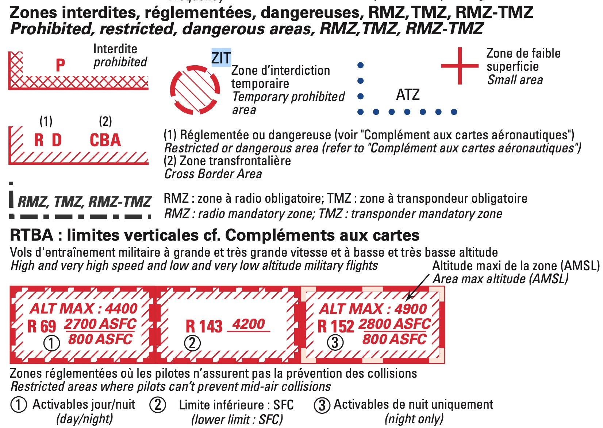

[comment]: # (S111V)
[comment]: # (Où peut être située une ZRT ? Uniquement en espace militaire-6 Uniquement en bordure d’un aérodrome-6 N’importe où)

## ZRT = **Zone Réglementée Temporaire**

Une **ZRT peut être située n'importe où** : autour d'un bâtiment (par exemple une centrale nucléaire) ou un événement particulier (tour de France), en fonction des besoins de la 

Une ZRT définit une réglementation spécifique (contact radio obligatoire, transpondeur obligatoire, altitude de transit…).  
Une ZRT peut donc être interdite au vol libre. C'est souvent le cas.

Cette zone est temporaire. Mais certaines ont du temporaire au temps long.

 

##  

### Quelles autres zones existent ?

- ZRT : Zone Réglementée Temporaire
- ZIT : Zone Interdite Temporaire
- Zone D : Dangerous (dangereuse)
- Zone R : Regulated (réglementée)
- Zone P : Prohibited (interdite)  
- RTBA : réseau de très basse altitude
- ségrégation (par exemple drône uniquement), transfrontalière, parachutage et voltige, parc naturel...

##  

🎶 🎶 *Allerr plus haut...* 🎶 *aller plus loin...* 🎶 mais sans rentrer dans un espace contrôlé ou interdit ! ➡️ 
[Wikipedia : Espace aérien](https://fr.wikipedia.org/wiki/Espace_aérien)

