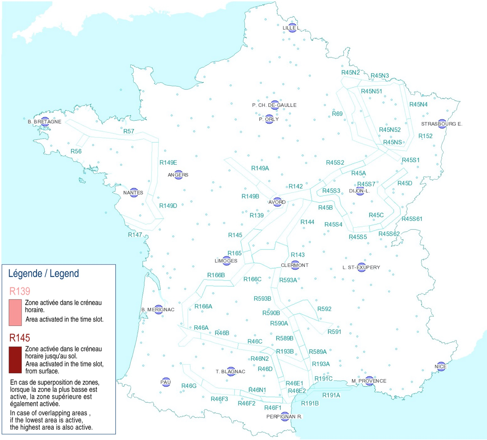

[comment]: # (S115V)
[comment]: # (Comment peut-on connaitre l’activité du RTBA ?)

## RTBA = Réseau très basse altitude

Il existe en France une série de zones aériennes reliées entres elles.

Les avions de l'armée y évoluent à **très basse altitude** et **très grande vitesse** (500 kt, ~900 km/h).  
Ils ne peuvent donc pas respecter les règles d'évitements VFR (voir et être vu).
Ces **zones sont donc strictement interdites aux autres aéronefs**. 

### 🤔 Z-truc et CT-machin ?

Une **ZIT** est une Zone Interdite Temporaire. Par exemple autour du tour de France chaque année.

Une **CTR** = (de l'anglais *control zone*, ou *control traffic region*)  
C'est une zone controlée autour d'un aérodrome pour protéger les vols à l'arrivée ou au départ.  
