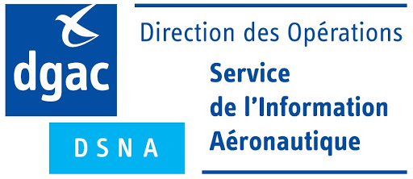

[comment]: # (S113V)
[comment]: # (Quel est le service officiel en charge de l’information aéronautique ?)

Le service en charge de l'Information Aéronautique est le [SIA](https://www.sia.aviation-civile.gouv.fr).

On y trouve, entres autres, les [activations des zones](https://www.sia.aviation-civile.gouv.fr/schedules) du réseau très basse altitude (RTBA), les NOTAM (messages d'informations aux pilotes / notice to airmen), etc.

