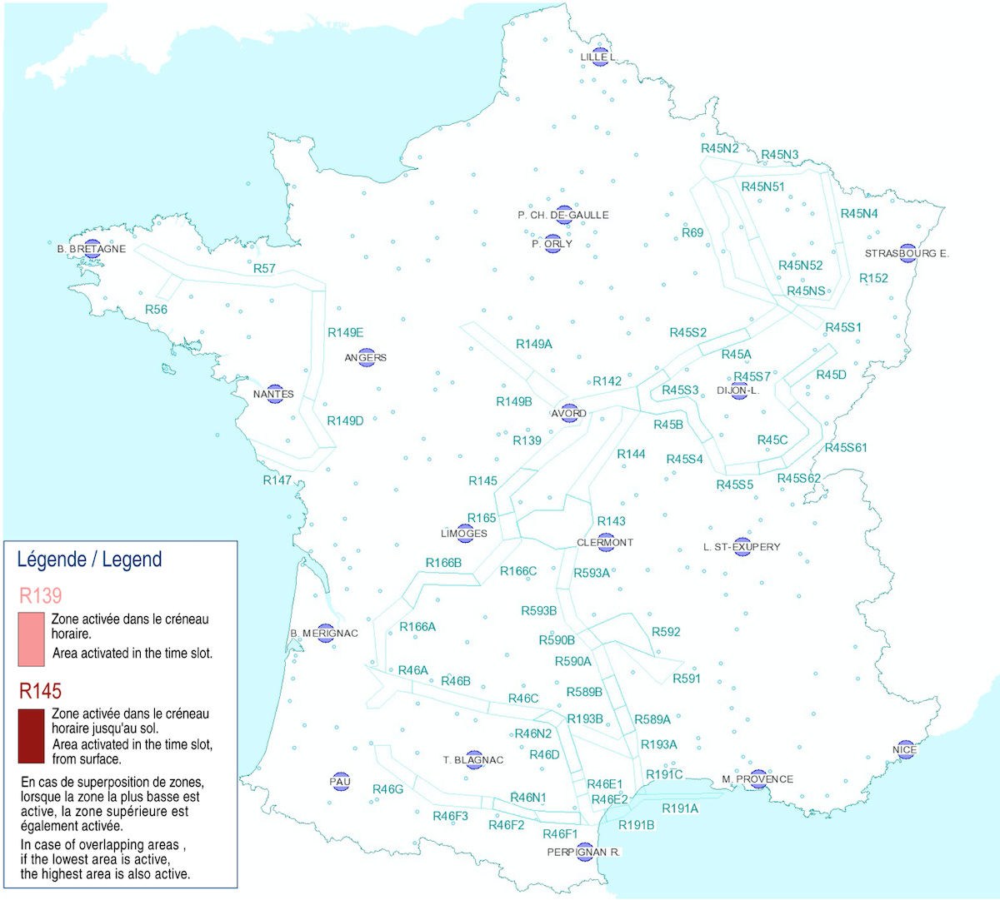
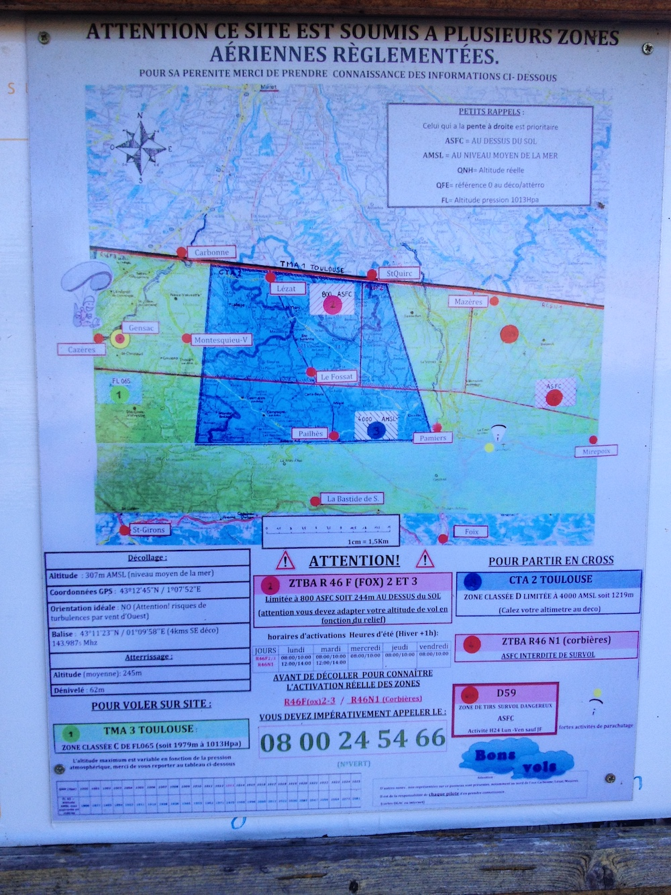
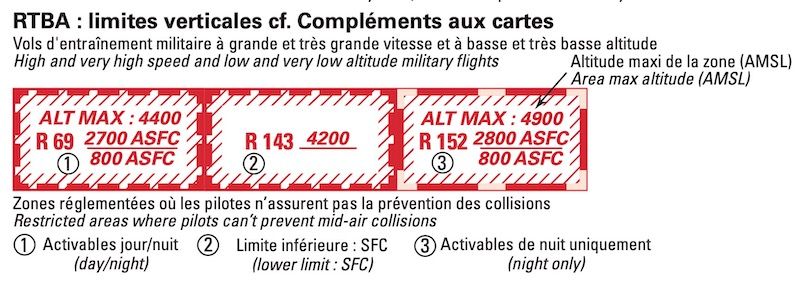

[comment]: # (S115V)
[comment]: # (Comment peut-on connaitre l’activité du RTBA ?)

[comment]: # (En parcourant le calendrier des exercices militaires-6)

[comment]: # (En lisant la carte aéronautique-6)

[comment]: # (En lisant le message AZBA sur le site du SIA)

## RTBA = Réseau très basse altitude

Il existe en France une série de zones aériennes reliées entres elles.

Les avions de l'armée y évoluent à **très basse altitude** et **très grande vitesse** (500 kt, ~900 km/h).  
Ils ne peuvent donc pas respecter les règles d'évitements VFR (voir et être vu).
Ces zones sont donc strictement **interdites aux autres aéronefs quand la zone est active**.

Il est donc important de connaitre son activité avant de vouloir la traverser.

## Zones actives ou pas ?

Pour connaître l'activité prévue, le SIA (Service d'Information Aéronautique) [publie quotidiennement les activations des différentes zones](https://www.sia.aviation-civile.gouv.fr/schedule).  
Vous pouvez aussi obtenir les informations au numéro vert : 0800.24.54.66

✅ Sur une carte aéronautique, on peut voir une zone RTBA, mais **pas son activité**.

## Je ne suis que parapentiste, suis-je concerné ?

Oui.
 
 

Par exemple, pour les Toulousains 😉, le site de Gensac-sur-Garonne est sous la zone R 46 F3.

La zone R 46 F3 commence 800 pieds (~240 mètres) au-dessus du sol, jusqu'à 3300 pieds (~1 000 mètres).