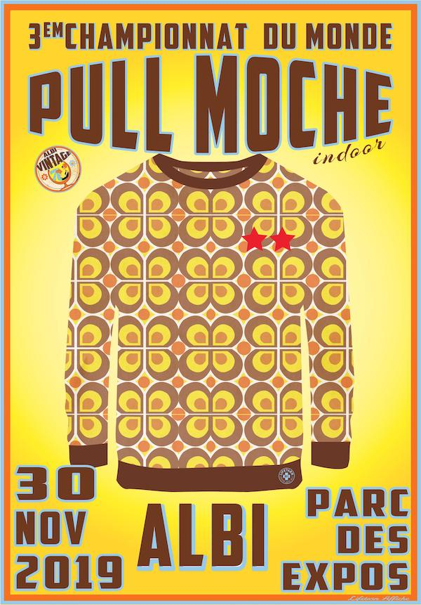

[comment]: # (S46V)
[comment]: # ( Un planeur ultra-léger (P.U.L.) :)
[comment]: # (vole grâce à l'énergie musculaire du pilote)
[comment]: # (n'est pas soumis à l'immatriculation)
[comment]: # (vole grâce à l'énergie potentielle)

### PUL = planeur ultraléger

Extraits de l'[arrêté du 3 mai 2017 relatif à l'utilisation des aéronefs ultralégers non motorisés](https://www.legifrance.gouv.fr/affichTexte.do;jsessionid=508625229E5B432ED062DA8891F899FD.tplgfr38s_2?cidTexte=JORFTEXT000034631299&dateTexte=20200318) :

> ✅ planeur ultraléger (PUL) : aéronef apte à décoller ou atterrir aisément en utilisant l'**énergie musculaire** du pilote et l'**énergie potentielle**.

donc un **parapente est un PUL**.

<figcaption>
À ne pas confondre avec un Pull, même si vous volez dans le Tarn et son célèbre [championnat du monde de Pull Moche](https://www.albi-vintage.fr/pull-moche).</figcaption>

Et

> Les aéronefs ultralégers non motorisés sont **dispensés de document de navigabilité**.

✅ Les PUL (donc les parapentes) n'ont pas besoin d'être immatriculés.

****