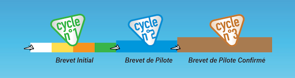
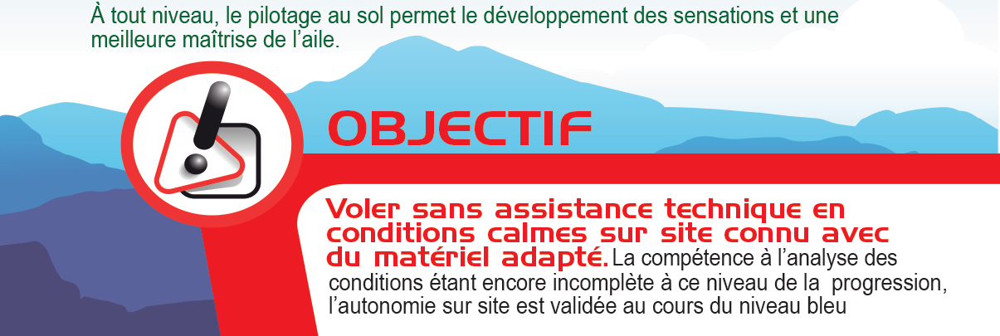
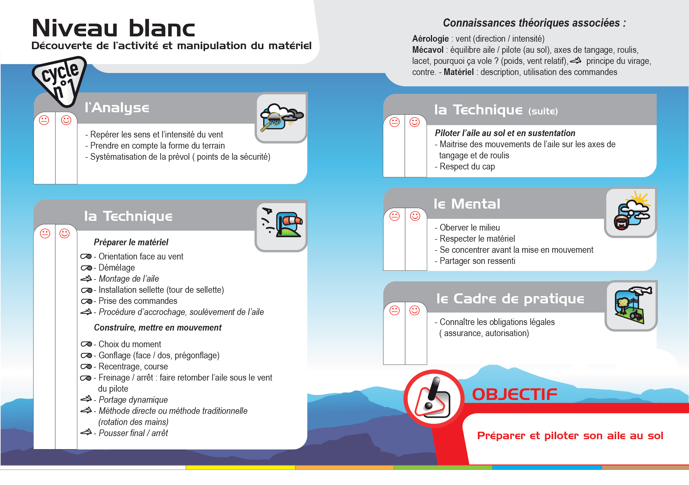
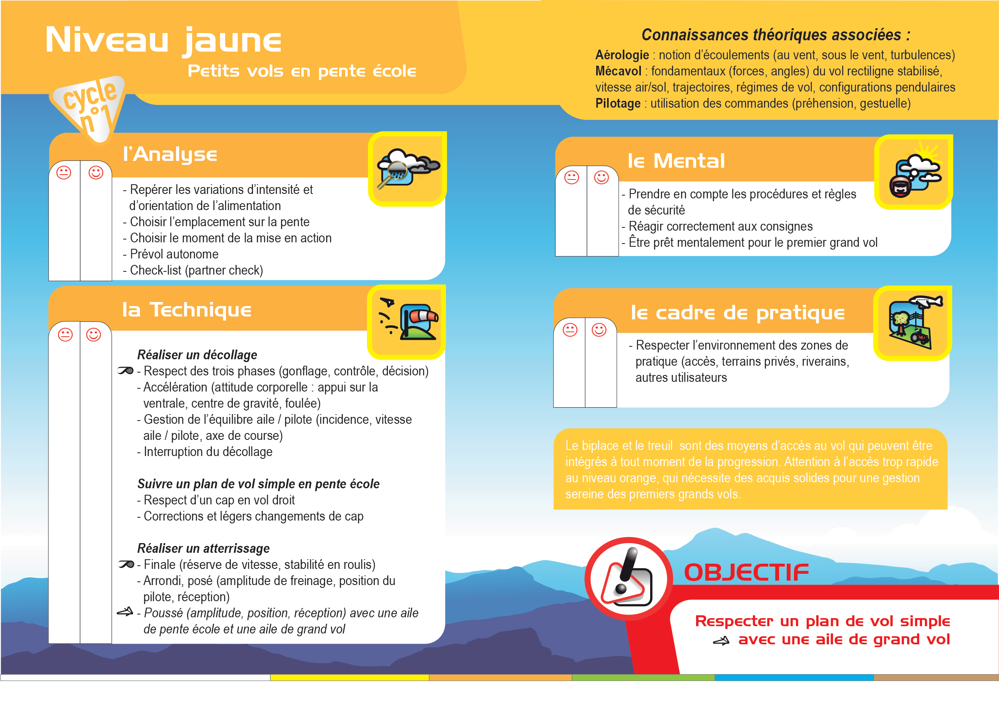
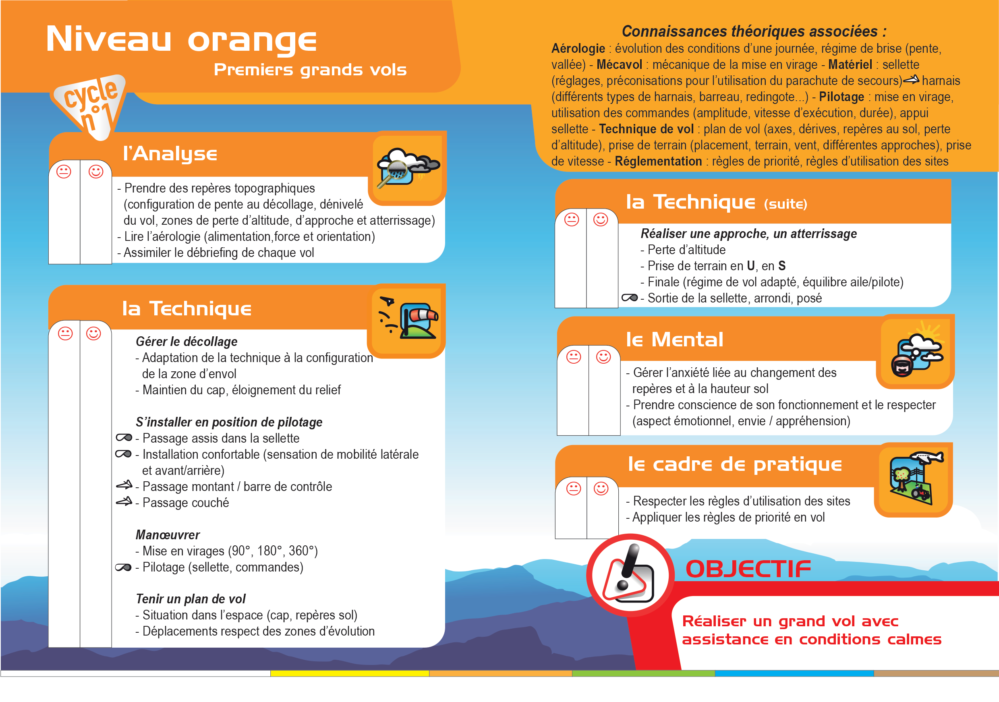
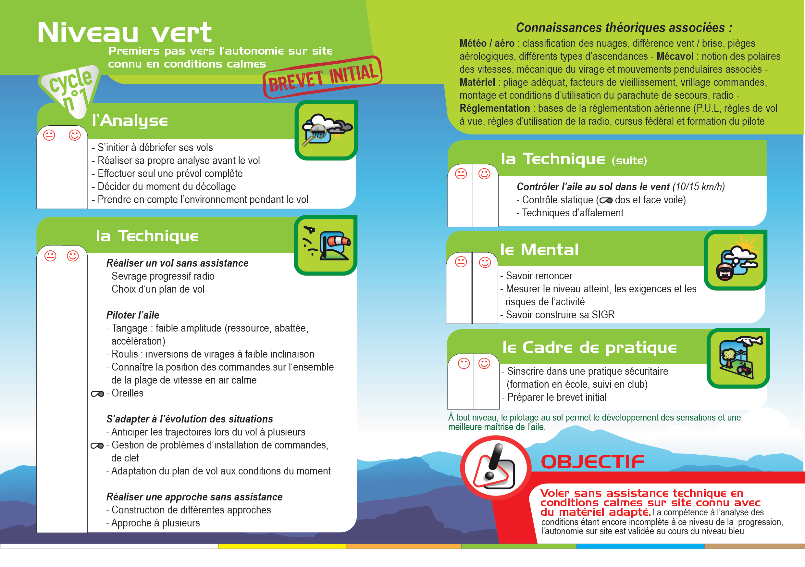
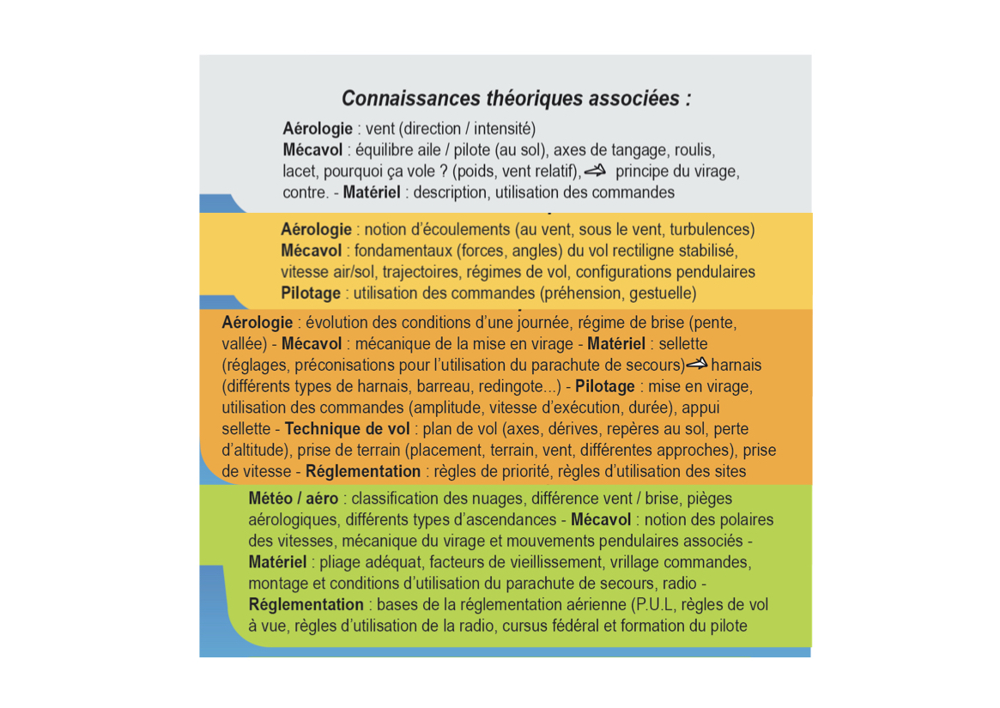

<!--
S5V
. Le brevet initial

atteste de la capacité à voler seul en conditions calme sur site connu3

est validé par un moniteur et certifié par l'école3

atteste de la capacité à évaluer et choisir les conditions aérologiques
-->

Pour valider le brevet initial, vous devrez valider les 4 niveaux du premier cycle : blanc, jaune, orange puis vert.

L'objectif du brevet initial est de voler **sans assistance <u>TECHNIQUE</u>** sur un **<u>site connu</u>** en <u>**conditions calmes**</u>.

Ces compétences et savoir sont validés par un moniteur, sur plusieurs axes : 

- Analyse
- Technique
- Mental
- Cadre de pratique

 
Dans le détail, niveau par niveau :
 





Et un résumé des connaissances théoriques attendues :

❌ <strike>`atteste de la capacité à évaluer et choisir les conditions aérologiques`</strike>

⚠️ ✅ Les notions d'aérologie normalement abordées ne vous permettent PAS de voir et interpréter autre chose qu'une aérologie calme.  

La phrase “_La compétence à l'analyse des conditions étant encore incomplète à ce niveau de la progression, l'autonomie sur site est validée au cours du niveau bleu_” est très clair. C'est le brevet de pilote qui vous permettra d'être autonome.

Petit rappel :  
L'aérologie est rarement calme en milieu de journée. C'est plus souvent le cas tôt le matin ou tard le soir.  
Dans tous les cas, référez-vous à ce que votre moniteur vous a dit lorsqu'il vous a présenté le site.

