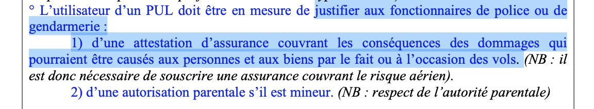

<!--
S92V (et ref. via S91V)
Sur un site ne faisant l'objet d'aucune restriction préfectorale particulière, un gendarme peut vous demander de présenter votre :

brevet fédéral-6

attestation d'assurance en responsabilité civile6

licence fédérale
-->

## Obligations
Il n’y a aucune obligation légale d’avoir un quelconque diplôme, brevet, licence pour voler en France avec un parapente.  

Un instinct de conservation primaire vous a sûrement poussé à suivre un stage dans une école (ou devrait vous y pousser 🥺).

Il n’y a aucune obligation légale de voler sous une aile homologuée ou révisée.  
Il n’y a pas plus d’obligation d’immatriculation ou d’identification de l’aile.  

Nous sommes parmi les rares usagers de l’air à avoir cette liberté. 

### Assurance Responsabilité civile aérienne

✅ La seule chose que la loi vous impose pour voler est d'être assuré en **responsabilité civile <u>aérienne</u>**.  
Ce n'est pas une obligation fédérale, mais la loi française :

Une assurance en responsabilité civile (ou RC) couvre les dommages corporels et/ou matériels que vous causez involontairement **à des tiers**.  

Cela couvre des dommages causés au sol, donc pas besoin d'une responsabilité civile terrestre.

### Autres assurances

Attention, quasiment systématiquement, le parapente est considéré comme un sport à risque et exclu de votre assurance domestique classique.

Vous pouvez choisir de vous couvrir également à titre personnel, mais ce n'est pas une obligation.  
Pour cela, vous devez souscrire à une assurance Individuelle Accident (IA) spécifique (pour recevoir un capital décès ou invalidité).  
Vous pouvez également souscrire une assurance qui prend en charge les frais de rapatriement.

Voir plus avec [les différentes couvertures d’assurance via la FFVL](https://federation.ffvl.fr/faq/quelles-sont-les-differentes-couvertures-d-assurance).

## Brevet et licence

Le brevet initial ne vous donne pas de droit particulier.  
C'est un outil pédagogique pour marquer votre progression. Utile à titre d'introspective individuelle, ou lors d'un changement d'école.

Vous n'avez pas d'obligation d'avoir une licence FFVL pour voler.