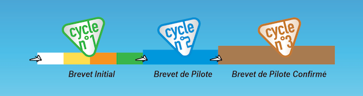
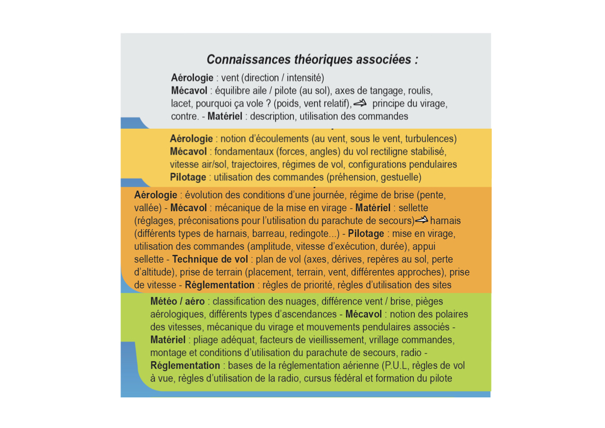

<!--
S96V
Le niveau du pilote est évalué :
-->

Franchement, il est bien connu que le niveau d'un pilote est mieux évalué par ses amis* —de préférence au bar après plusieurs tournées 🍻— plutôt que par un moniteur diplômé qui va s'appuyer sur un support pédagogique adapté.  

Support tel que, je sais pas, par exemple, le **[passeport de vol libre](https://efvl.ffvl.fr/mesurer_progression)** : 

## Cycle 1

[comment]: # (fichiers via https://efvl.ffvl.fr/sites/efvl.fr/files/22-23%20niveau-marron.png )

### Niveau blanc

### Niveau jaune

### Niveau orange

### Niveau vert

Le niveau vert marque la validation du cycle 1, et l'obtention du **brevet initial**.

### Connaissances théoriques Cycle 1

Pour valider le brevet initial, vous devrez comprendre et maitriser ces connaissances :  

## Cycle 2

### Niveau bleu

Le niveau bleu correspond au **brevet de pilote**.

## Cycle 3

### Niveau marron

Le niveau marron correspond au **brevet de pilote confirmé**.

   
* PS : 🏅 Mention spéciale si le niveau est auto-évalué ; Darwin veille sur toi mon enfant.

