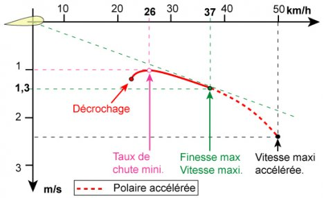

<!--
U24V
Après une course de décollage à l'arraché, vous réussissez à décoller de justesse :

vous volez certainement avec beaucoup trop de vitesse, vous pouvez donc ralentir pour vous mettre au taux de chute mini -6

pas immédiatement assez lucide pour me sentir être trop lent ou trop rapide, dans le doute je m'écarte du relief 3

pas immédiatement assez lucide pour me sentir être trop lent ou trop rapide, dans le doute je prends de la vitesse 3
-->

Vous venez de “*décoller de justesse*”. Cela implique que vous n'avez pas assez de vitesse pour voler (car pas assez de vitesse pour générer de la portance).  

* Ralentir risque de vous faire décrocher ❌

### dans le doute, **Sécurité avant tout !**
* ✅➡️ s'écarter des obstacles (dont le relief) est toujours une bonne idée 😉
* ✅➡️ prendre de la vitesse (bras haut) permet de s'assurer que la voile est dans un régime de vol loin du décrochage. C'est aussi la finesse max.

Auteur : [Pierre-Paul MENEGOZ](http://www.ppmenegoz.com/spip.php?article99)