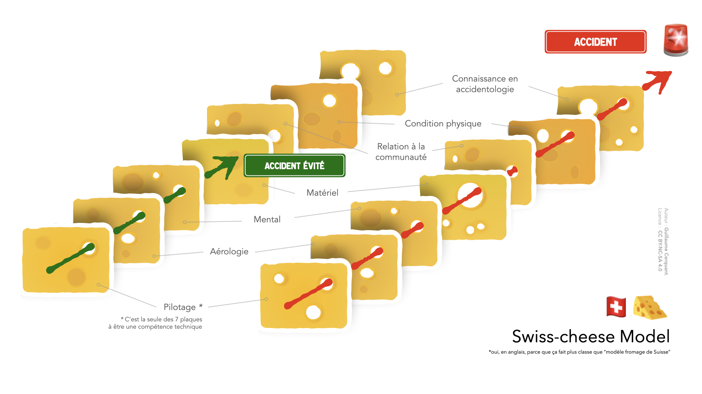
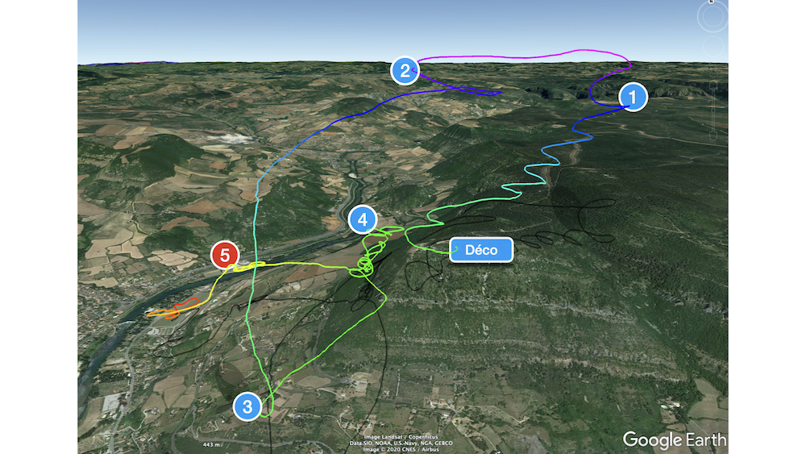

<!--
U2V
Appliquer la règle des additions c'est :0

mesurer les risques et ne pas les additionner2

identifier les éléments nouveaux d'une situation et n'en accepter qu'un à la fois2

éviter le cumul de facteurs stressants qui, pris séparément, ne conduiraient pas à l'accident mais qui, additionnés, rendent le risque inacceptable

-->

 

 
### *“Mieux vaut regretter être resté au sol, que <mark>regretter être en l'air</mark>.”*

 

# 🇨🇭🧀 Swiss-cheese modèle

Le modèle du Swiss-Cheese est souvent utilisé en accidentologie dans l'aviation.

Chaque tranche de fromage est une barrière à un accident.  
Plus vous additionnez les trous (ou risques), plus il est probable qu'il existe un chemin où il y a un trou à chaque barrière : c'est l'accident.

Additionner les risques, c'est augmenter la probabilité d'un accident.

## Un risque à la fois

Pour limiter les risques, il faut aussi limiter les nouveautés et risques.  
Il n'est pas possible d'accorder suffisamment d'attention aux automatismes du vol tout en gérant trop de nouveautés et imprévus.

- Je change de matériel => je le fais sur un site connu.  
- Je suis stressé (boulot, famille, etc) => je ne vole pas dans des conditions fortes. Ou pas du tout.
- Je découvre un site => je n'essaye pas de suivre un groupe en cross.
- En l'air je ne comprends plus l'aérologie => je ne continue pas à voler si j'ai froid.

# En parapente, les risques sont invisibles

Le parapente est un sport engagé, à risque.  
Sauf que notre support d'évolution, l'air, est invisible. Les marges à prendre sont donc beaucoup plus grandes que dans d'autres activités.

Il faut du temps et de la pratique pour apprendre à détecter et interpréter les signes, souvent invisibles directement. C'est la formation et l'expérience qui vont vous le permettre. Ne brûlez pas les étapes.

# <i>Expérience personnelle</i>

Un vol m'a fait changer le dicton en introduction.   
C'est très fun de voler, jusqu'au moment où ça ne l'est plus du tout. Et là, mentalement, ça change vite de dimension. Très vite.    
 
&nbsp;&nbsp;&nbsp;&nbsp;J'ai un souvenir en tête en particulier. 
Titulaire du brevet initial, j'hésite à me mettre en l'air car une brise marquée souffle sur le déco.  

Je craignais de me faire arracher au décollage. J'ai attendu, observé un autre pilote décoller, senti une baisse du vent. Confirmé ça avec la balise. Attendu un peu. 
 
 
Soyons honnête : quelques jours avant, sur le même site, avec les mêmes conditions météo, j'avais attendu. Trop. Et une fois en l'air, plus d'activité thermique.  

Résultat : 7 minutes. Un maigre plouf.   
Rageant. Encore plus quand tu vois les copains qui ont profité du dernier cycle pour continuer à en profiter.   
Erreur 0 : avoir peur de regretter de ne pas avoir voler.

Et comme je vole beaucoup en ce moment, que nous évoluons depuis plusieurs jours sur les sites du coin, j'ai confiance en moi. 
Je sors d'un stage pendant lequel j'ai bien volé. 
1ère erreur d'analyse : j'ai à nouveau oublié qu'en sortant de stage, par excès de confiance j'ai tendance à trop réduire mes marges de sécurité.  

Je passe un moment à observer ceux qui volent. Ils montent bien.
2ème erreur : C'est pas parce qu'il y a des pilotes en l'air que c'est des conditions que JE vais apprécier. 
3ème erreur : biais cognitif classique : je trouve ce que je cherche. Comme je voulais voler, je cherchai cette confirmation. Je n'ai pas vraiment cherché des signes m'indiquant que je devrai renoncer.
   

Je me suis mis en place pour le déco. Je suis descendu en bas de la pente, pour gérer un éventuel arrachement. 
Un autre pilote était juste devant moi. Il a raté son déco. M'a proposé d'y aller avant le temps qu'il réinstalle son GPS. 

Et là, on s'est retrouvé à ne plus avoir de brise du tout.   
4ème erreur. Ce n'était pas du vent météo, mais en fait l'activité thermique qui remontait le long de la pente.  

10 minutes d'attente, où j'ai alors compris que l'on était sous le vent du thermique. 
5ème erreur : ne pas remettre en question la décision de décoller. C'est pas parce qu'à un moment tu t'es dit j'y vais que tu dois continuer. La décision de renoncer peut-être prise jusqu'à la tempo.   
Et à minima, doit être re-prise si un élément nouveau arrive comme c'est le cas ici.  

J'insiste : même après avoir décollé ton aile, il est encore temps de renoncer, et pas juste à cause d'une clef.  

J'ai fini par décoller. Suis monté comme un bouchon. Aucune idée des valeurs, mais je me rappelle avoir poussé un *Youhou !* aux copains dans mon dos en passant. Je les voyais pas mais ce Youhou était plus pour moi que pour partager quelque chose.   

Je fais 7 tours dans le thermique, et monte de 750 mètres. En moins de 5 minutes.  
Ça fait une **moyenne** de +2,5m/s.  

C'est joufflu (pour moi, par rapport à mon niveau de cet époque). Mais je suis confiant.  
Je verrai quand même après sur ma trace une Vz max à +5,6m/s    

  

(1) Dérivant trop par rapport à la montée, pour ne pas me retrouver au dessus de la forêt sans option de vache, je lâche le thermique.    

(2) Ayant pris de la hauteur, je décide de m'avancer dans la vallée.  
En espérant aussi y trouver un thermique plus organisé, moins tonique. Après tout, c'était le cas hier.    
6ème erreur (avec tous ces trous, il n'y a bientôt plus de fromage) : ne pas faire l'analyse mentale que si je recherche du "tranquille", c'est que je suis peut-être déjà pas loin de mes limites.   

(3) Finalement, je ne trouve rien, et décide de revenir au relief. (4) Un peu trop de monde, un peu trop prêt du relief, un peu trop d'activité thermique.   Je décide d'aller poser.  

(5) J'arrive dans la vallée. pour poser. Et là, je me fais secouer. Mais pas secouer je gère.   
Secoué, je gère mais je flippe. Va savoir pourquoi, mais un verrou mental saute.  

À aucun moment je ne perds le contrôle de la voile. Ça tangue, mais je récupère à chaque fois. J'ai déjà créé des abattées bien plus forte en les travaillant. Pas non plus de fermeture ni de claquements de stabilos.   

Mais là ce n'est pas *moi* qui décide. 
7ème erreur : ce n'est pas parce que j'ai le niveau technique que j'ai le niveau mental. Et vice-versa.  

Je passe les 10 pires minutes de ma vie. Parce que je crois qu'elles vont être les dernières.    
Le pire : ça dure au maximum 2 minutes.   
Ah, je suis heureux d'être là, les 10 pires dernières minutes de ma vie ne durent même pas 10 minutes.   

Je descends en 360. Mais le vario continue à bipper vers le haut. J'en rigole en l'écrivant, mais sur le coup, j'aurai donné cher pour faire un plouf. Même tout maigre de 7 minutes.  

Je rajoute les oreilles, et finis par descendre. Ma sérénité, elle, s'est envolée depuis longtemps. Elle mettra un moment avant de revenir. 
8ème erreur : ne brûlez pas les étapes de l'apprentissage du parapente, vous n'apprécierez pas et irez plus lentement.    

Il s'est avéré que les conditions était “à peine” un cran au dessous de mon mental du jour. “Juste un peu beaucoup”, c'était “juste <strike>un peu</strike> trop”. 

En fin de journée je suis reparti voler. Dans des conditions parfaitement adaptées, 45 minutes d'un vol pur plaisir.   
Depuis, j'ai changé le dicton du champ lexical :
   

 
### *“Mieux vaut avoir peur de regretter être resté au sol, qu'avoir <mark style="background: orange;"> peur en l'air</mark>.”*

 

— <i>Guillaume&nbsp;&nbsp;&nbsp;&nbsp;&nbsp;</i>
