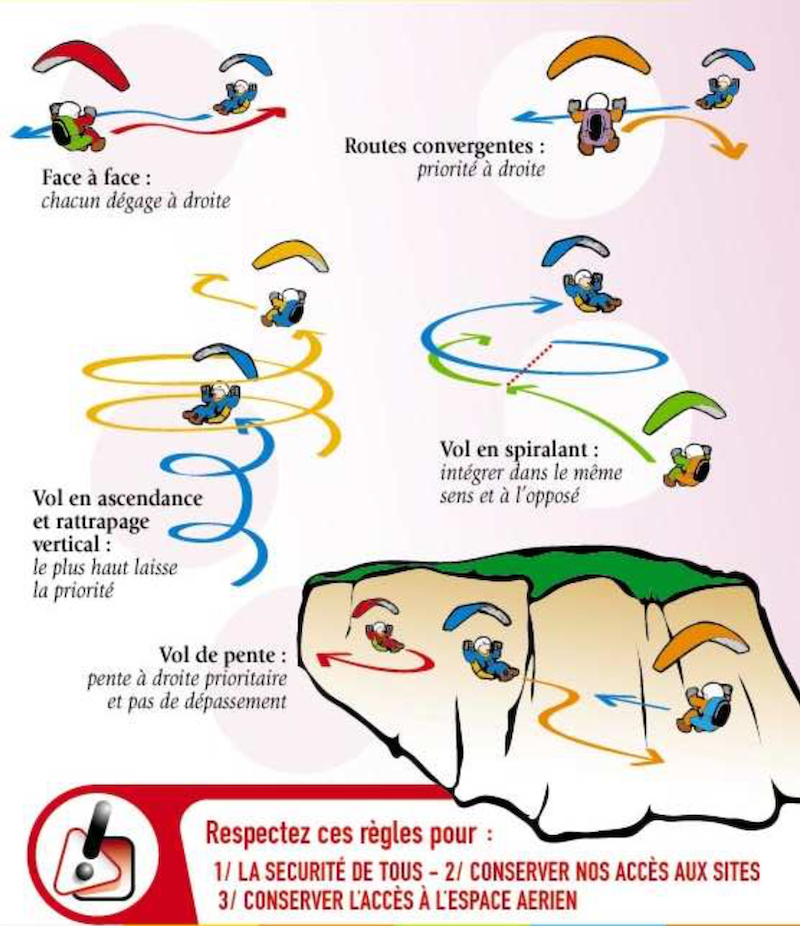

<!--
Question U90V
Je vole dans l’ascendance en longeant le relief sur ma droite, une aile arrive en face)
-->

### Règle de priorité le long du relief

Le long du relief, **j'ai la priorité si j'ai la falaise à ma droite**.  

### Et si je suis débutant ?

✅ Les règles sont les mêmes que je sois débutant ou expérimenté.  
D'ailleurs, comment on pourrait connaître le niveau du pilote en face ?

### Une priorité se donne, elle ne se prend pas

Dans la question posée, vous avez la priorité. Oui, mais.  
Mon prof d'auto-école m'avait répondu un jour où je n'avais pas eu envie de laisser passer la voiture qui voulait me griller une priorité à droite :   
**oui... mais tu ne veux pas mourir prioritaire !**

✅ Si le pilote en face semble ne pas me céder la priorité, je ne force pas. Il ne m'a peut-être pas vu, il ne maîtrise peut-être pas les règles, il croit à tord qu'il y a assez de place, etc.  

Les règles de l'air ([SERA](https://federation.ffvl.fr/sites/ffvl.fr/files/2016_Reglementation_aerienne_VL_version_SERA_2014-2-def.pdf)) ont même explicité ce cas :

> 3201 Généralités :  
> aucune disposition du présent règlement ne dégage le pilote commandant de bord d’un aéronef de la responsabilité de prendre les mesures les plus propres à éviter un abordage.

## Sécurité d'abord, dans le doute je fais demi-tour.